# Báo cáo tổng hợp thực nghiệm: visual-token retention, attention allocation và speculative acceptance

Ngày tổng hợp: 2026-09-18  
Phạm vi artifact: 2026-08-19 đến 2026-09-18  
Phiên bản này được tái cấu trúc theo câu hỏi nghiên cứu và hypothesis. Các hình trong báo cáo được sinh tự động từ artifact bằng `src/analyze/plot_hypothesis_report.py`.

## Tóm tắt điều hành

Mục tiêu là kiểm tra giả định rằng một phần visual semantics có thể đã được nội suy vào text semantics, trong khi visual positions vẫn ảnh hưởng đến attention vì chúng tiếp tục tham gia vào mẫu số của softmax. Hai hiệu ứng đối nghịch cần phân biệt là:

- `attention dilution`: giữ quá nhiều visual positions làm attention bị phân tán vào visual context, khiến các text token hữu ích nhận ít mass hơn;
- `text over-attention`: xoá quá nhiều visual positions làm attention dồn vào một số text token, có thể làm thay đổi mạnh representation hoặc output.

Kết luận đáng tin cậy nhất hiện tại là ở cấp cơ chế attention: trên Qwen2-VL-7B + MSD, giảm hoặc xoá visual positions làm visual mass giảm và text mass tăng có hệ thống trên VDC50 và MVBench. Zeroing visual values không làm thay đổi attention map, nhưng làm thay đổi draft logits; do đó vai trò của vị trí/key–query và vai trò của value có thể tách riêng.

Các kết luận về chất lượng câu trả lời, hidden-state out-of-distribution (OOD), hoặc “visual attention là attention lãng phí” vẫn chưa được xác nhận. `accepted_prefix_tokens` chỉ đo draft–target agreement trong speculative decoding, không phải answer accuracy. H1a còn thiếu training hidden-state reference. H3.2 hiện đã chạy đủ VDC50 cho depth1/3/5; MVBench vẫn đang chạy nên chưa được dùng cho kết luận tổng quát.

Riêng H3.1 cần đọc theo provenance: DFlash/Qwen2.5-VL-3B đã có position
study đầy đủ trên VDC50 (`n=50`), trong khi MSD/Qwen2-VL-7B mới có position
pilot (`n=2`). Kết quả DFlash full không cho thấy late-only gain; kết quả MSD
pilot chỉ là exploratory và không được gộp vào DFlash.

## 1. Bản đồ câu hỏi, hypothesis, thực nghiệm và kết quả

| Câu hỏi | Hypothesis cần kiểm tra | Thực nghiệm đã dùng | Kết quả hiện tại | Trạng thái |
|---|---|---|---|---|
| Q1. Attention allocation có tạo ra trade-off không? | H1a: text over-attention có thể làm hidden state lệch khỏi training distribution | E4 layerwise proxy; E6 full attention/value; cần thêm training hidden statistics | Text mass tăng sau visual deletion, nhưng chưa đo được OOD distance | Chưa xác nhận H1a |
| Q1 | H1b: giữ quá nhiều visual gây dilution, xoá hết gây over-attention | E1 length sweep; E2 retention sweep; E3 attention theo length; E5 expanded Real/Zero + density; E6 full H1b | Allocation chuyển visual → text một cách đơn điệu; density cho thấy thay đổi không chỉ do số key; chưa chứng minh optimum hoặc accuracy trade-off | Hỗ trợ ở cấp attention |
| Q2. Vì sao VDC cut không tốt hơn baseline? | H2.1: nếu prompt thiếu answer semantics, visual information vẫn cần cho việc trả lời | E7 factorial trên MSD và E7-DFlash factorial có attention logging | MSD cho interaction âm; DFlash cho interaction dương nhưng chưa có accuracy; density cho thấy raw hint mass bị confound bởi số key | Chưa xác nhận |
| Q3. Vì sao acceptance thay đổi sau visual cut? | H3.1: gain chỉ xuất hiện sau khi target đã trả lời một nửa | H3.1-DFlash full bổ sung; MSD pilot chỉ dùng để truy vết, không dùng định lượng | DFlash full `n=50` không cho thấy late-only gain; MSD `n=2` bị loại khỏi bằng chứng vì chưa đủ cỡ mẫu | Chưa xác nhận |
| Q3 | H3.2: drafter nhiều layer đọc visual tốt hơn drafter một layer | E10 depth-controlled DFlash depth1/3/5 trên VDC; MVBench full đang tiếp tục | VDC LLaVA68K có interaction dương ở D3−D1 và D5−D1; ShareGPT68K có interaction âm; chưa có MVBench full | Đã có kết quả VDC, chưa tổng quát |

Các nhãn `E1`–`E10` chỉ là mã truy vết. Phần phân tích chính bên dưới đi theo từng hypothesis, không đi theo thứ tự thực nghiệm.

## 2. Thiết kế chung và phạm vi diễn giải

### 2.1. Model, dữ liệu và provenance

| Nhóm artifact | Target/drafter | Cohort | Vai trò | Tính hợp lệ |
|---|---|---|---|---|
| Qwen2/MSD mới | Qwen2-VL-7B / MSD-Qwen2VL-7B | VDC50 và MVBench 1.000 mẫu | H1b full, H2.1 full | Đủ coverage, không có error row |
| Qwen2/MSD cũ | Qwen2-VL-7B / MSD-Qwen2VL-7B | VDC cohort cũ | length, retention, attention, layer proxy | Pipeline validity gate = TRUE |
| Qwen2.5/DFlash follow-up | Qwen2.5-VL-3B / local DFlash checkpoint và depth-controlled HF checkpoints | VDC50, `n=50`; MVBench `1,000` mẫu đang chạy | E7-DFlash H2.1 (`300` rows), H3.1 (`150` rows), H3.2 VDC (`600` rows) | VDC full; MVBench H3.2 chưa đủ coverage; không gộp với MSD |
| Qwen2.5/DFlash legacy | Qwen2.5-VL-3B / DFlash checkpoint | VDC50 và MVBench cohort cũ | length, retention, attention, position | Incomplete diagnostic; không gộp với run mới |

Run Qwen2/MSD mới dùng model-parallel trên RTX 3090 24 GB và RTX A4000 16 GB. VDC dùng `dataset/VideoDetailCaption/test.jsonl` với 50 video. MVBench dùng `dataset/MVBench/classified/selected.jsonl` với 1.000 record, gồm năm task, mỗi task 200 record. Một số artifact DFlash cũ dùng MVBench500; kích thước cohort khác nhau nên không được gộp trực tiếp.

> **Lưu ý provenance cho H3.1:** có hai study độc lập. MSD/Qwen2-VL-7B là
> position pilot trên VDC@3K với `n=2`; DFlash/Qwen2.5-VL-3B là full study
> trên VDC50 với `n=50`. Con số `n=2` chỉ áp dụng cho MSD pilot, không mô tả
> run DFlash full và không được dùng để thay thế cỡ mẫu `n=50` của run đó.

### 2.2. Intervention và control

Target giữ full visual input trong các phép đo acceptance. Intervention được đặt trên draft context.

| Điều kiện | Visual positions trong draft | Visual values trong draft | Mục đích |
|---|---|---|---|
| Full/real | Giữ toàn bộ | Giá trị thật | Baseline |
| Reduced 25%/real | Giữ 25% | Giá trị thật | Kiểm tra retention |
| Deleted/real | Xoá | Không còn | Kiểm tra tác động của position removal |
| Full/zero hoặc Reduced/zero | Giữ positions | Zero | Cô lập vai trò visual value khỏi attention allocation |

### 2.3. Metric và guardrail

- `visual_mass`, `text_mass`, `instruction_mass`: attention mass trên các key đứng trước query, trung bình theo head/layer trong record. Trong E6, `instruction_positions` là các token user-text thông thường sau visual positions và trước assistant marker, nên thường tương ứng với câu hỏi của sample. `text_positions` là phần key còn lại ngoài visual/instruction; theo implementation hiện tại nhóm này có thể bao gồm token của chat template, delimiter/special token và text nằm ngoài vùng câu hỏi. Vì vậy `text_mass` không được đọc như question-only mass.
- `accepted_prefix_tokens`: số proposal được chấp nhận trung bình trong mỗi verification step; đây là alignment metric, không phải accuracy.
- `lossless` và `lossless_prefix_length`: speculative output có khớp target continuation của cùng prompt hay không.
- `value_ablation_logit_max_abs_delta`: sai khác lớn nhất giữa draft initial next-token logits khi visual values là real và zero.
- `value_ablation_top1_match`: top-1 draft token có giữ nguyên hay không.
- `value_ablation_kl_forward/reverse`: KL giữa hai draft distributions. Ở temperature greedy hiện tại, metric này bị numerical saturation về 0 và không được diễn giải là hai phân phối giống hệt nhau.

### 2.4. E0 — Smoke, parity và instrumentation

E0 là kiểm tra tính đúng của pipeline, không phải thực nghiệm để chứng minh một hypothesis. Smoke record đầy đủ tại mốc khoảng 3K visual tokens có các thống kê sau:

| Sample | Condition | Actual visual tokens | Verification steps | Accepted-prefix `k` | Lossless prefix | Lossless | Native parity | Max abs logit error |
|---|---|---:|---:|---:|---:|---|---|---:|
| `v_AwgGYaV1lT0` | Full | 3,128 | 31 | 1.0968 | 64/64 | Yes | Valid | 0.0 |

Các instrumentation check cũng xác nhận: attention hook lấy đúng draft attention; logit probe lấy `draft_initial_next_token`; output/target hash được lưu; và các run hợp lệ có native prefill parity với `max_abs_logit_error=0.0`. E0 không cung cấp cỡ mẫu để suy luận thống kê.

## 3. Q1 — Attention allocation và H1

### 3.1. H1a — Text over-attention có làm hidden state lệch khỏi training distribution?

#### Phát biểu và dự đoán

H1a được tách khỏi H1b như sau: visual deletion có thể làm text attention tập trung quá mạnh; nếu điều đó làm representation bất thường, hidden state sau intervention sẽ lệch khỏi phân phối hidden state trên training data.

| Kết quả quan sát | Diễn giải cho H1a |
|---|---|
| Text mass tăng, hidden norm/logit margin tăng bất thường, khoảng cách Mahalanobis tới training distribution tăng, và quality giảm | Hỗ trợ H1a |
| Text mass tăng nhưng hidden distribution không lệch hoặc quality không giảm | Attention redistribution có thật, nhưng H1a về OOD/quality không được hỗ trợ |
| Không có text concentration | Không hỗ trợ cả cơ chế over-attention |

#### Thực nghiệm đã thực hiện

- `E4`: vẽ layerwise cosine giữa representation hiện tại và representation đầu vào. Đây chỉ là information-retention proxy.
- `E6`: full H1b đo text mass, top-five text-token mass, entropy, logit delta và top-1 match trên VDC50/MVBench.
- Thực nghiệm bắt buộc còn thiếu: chạy cùng model trên training cohort, lưu hidden mean/covariance theo layer và token role, rồi tính Mahalanobis distance hoặc một khoảng cách phân phối tương đương.

#### Kết quả và hình

`E4` cho thấy visual cosine proxy giảm từ khoảng `0.965` ở layer 1 xuống `0.054` ở layer 28; text cosine cũng giảm về gần `0.004`. Hình 1 trình bày toàn bộ 28 layer; full numerical table với `n=30` và 95% CI được giữ trong [figure6_statistics.csv](../../results/sparrow_validation_qwen2vl_final_20260819/figure6_statistics.csv). Hai điểm đầu/cuối để định hướng là:

| Layer | n | Visual cosine | Text cosine |
|---:|---:|---:|---:|
| 1 | 30 | 0.9651 [0.9609, 0.9689] | 0.1300 [0.1298, 0.1301] |
| 28 | 30 | 0.0536 [0.0480, 0.0591] | 0.0040 [0.0038, 0.0043] |

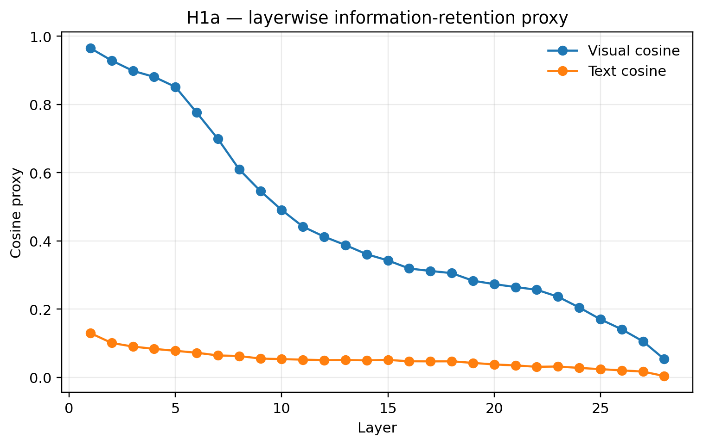

*Hình 1. Proxy layerwise được dùng để mô tả representation dynamics; không được dùng thay cho training-distribution comparison.*

#### E6 — Full attention/value evidence được dùng lại cho H1a

E6 cũng là thực nghiệm trực tiếp liên quan đến H1a vì nó đo text concentration sau khi xoá visual positions. Vì vậy kết quả này được tham chiếu lại ở đây, dù nó đồng thời là thực nghiệm chính của H1b. Với real visual values, mean attention mass của toàn bộ 12 nhóm dataset × query policy × condition được biểu diễn trong [Hình E6 về attention mass](figures/h1b_attention_mass.png); SD và `n` của từng nhóm được giữ trong các JSONL nguồn của E6 (xem Artifact index). Bảng ngắn dưới đây chỉ giữ phép đối chiếu chính của query `last_instruction`:

| Dataset | Text mass Full | Text mass Deleted | Deleted − Full (95% CI) |
|---|---:|---:|---:|
| VDC50 (`n=50`) | 0.0953 | 0.6925 | +0.5972 [0.5553, 0.6367] |
| MVBench (`n=1,000`) | 0.4305 | 0.6390 | +0.2084 [0.2061, 0.2107] |

Text-mass paired change relative to Full là `+0.1441` (VDC50 Reduced), `+0.5972` (VDC50 Deleted), `+0.0811` (MVBench Reduced) và `+0.2084` (MVBench Deleted). Bootstrap 95% CI tương ứng là `[0.1181, 0.1729]`, `[0.5553, 0.6367]`, `[0.0796, 0.0827]` và `[0.2061, 0.2107]`. Top-five text-token mass tăng `0.0517 → 0.3256` trên VDC50 và `0.2127 → 0.3009` trên MVBench.

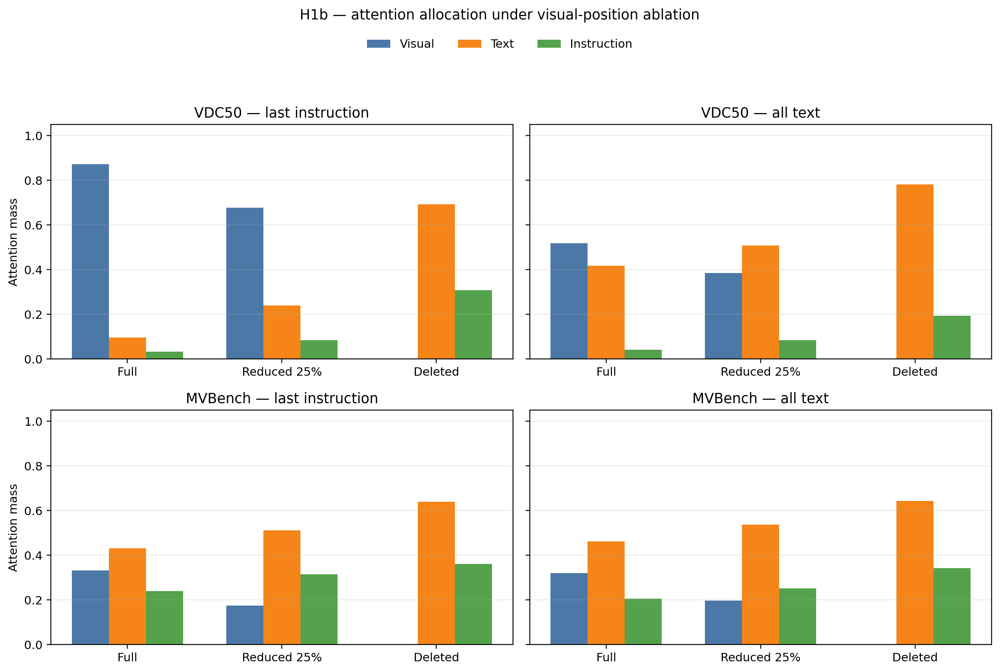

*Hình 2. Hình E6 được lặp lại trong H1a vì nó cung cấp bằng chứng về sự tái phân bổ attention sau visual deletion. Cần đọc đúng các nhóm token: `instruction_mass` mới là nhóm gần nhất với câu hỏi/instruction của sample; `text_mass` là nhóm key không-phải-visual còn lại và có thể chứa token của chat template hoặc delimiter. Do đó hình cho thấy mass chuyển khỏi visual positions sang các key không-phải-visual, chưa chứng minh attention tập trung riêng vào các từ có nghĩa trong câu hỏi. Nó cũng không thay thế phép đo hidden-state distance tới training distribution.*

Visual-value control của E6 cũng được lặp lại để hoàn chỉnh H1a:

| Dataset | Condition | Mean max abs(Δ logit) | Forward KL | Reverse KL | Top-1 match | Attention-mass Δ real/zero |
|---|---|---:|---:|---:|---:|---:|
| VDC50 | Full | 1.1622 | 0 | 0 | 100% | 0 |
| VDC50 | Reduced 25% | 0.5830 | 0 | 0 | 100% | 0 |
| VDC50 | Deleted | 0.0000 | 0 | 0 | 100% | 0 |
| MVBench | Full | 0.2176 | 0 | 0 | 100% | 0 |
| MVBench | Reduced 25% | 0.2199 | 0 | 0 | 100% | 0 |
| MVBench | Deleted | 0.0000 | 0 | 0 | 100% | 0 |

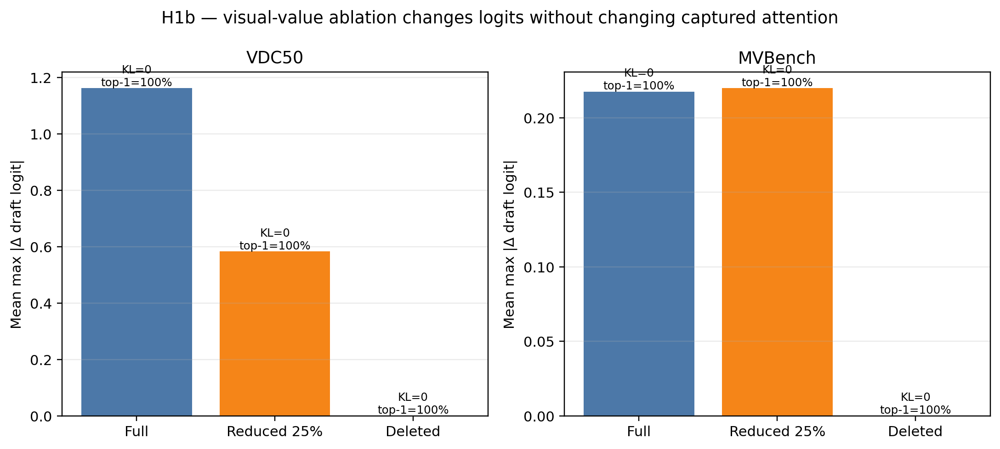

*Hình 3. Value ablation được lặp lại trong H1a để chỉ rõ: zeroing visual values giữ nguyên visual positions nên không làm đổi attention allocation, nhưng vẫn có thể làm đổi draft logits. Các nhóm `text_mass`/`instruction_mass` ở đây vẫn mang đúng quy ước token-role của E6; đặc biệt `text_mass` không đồng nghĩa với attention chỉ vào câu hỏi.*

#### Kết luận H1a

H1a **chưa được kiểm chứng**. Full H1b chứng minh text mass tăng, nhưng workspace không có training examples, teacher hidden cache hoặc saved training hidden-state statistics. Vì vậy chưa được kết luận rằng text over-attention làm output embedding rơi khỏi phân phối gốc.

### 3.2. H1b — Attention dilution đối nghịch với text over-attention

#### Phát biểu và thiết kế kiểm định

H1b kiểm tra xem thay đổi số lượng visual positions có tạo ra sự chuyển mass giữa visual và text hay không. Ba condition được chạy trong cùng protocol; value-zero là control để kiểm tra liệu thay đổi attention có đến từ values hay từ Q/K và denominator của softmax.

Các kết quả có thể phân biệt như sau:

| Kết quả | Kết luận tương ứng |
|---|---|
| Full có visual mass cao và text mass thấp; Reduced/Deleted chuyển mass sang text một cách có hệ thống | Hỗ trợ cơ chế position/softmax allocation |
| Zero value giữ nguyên attention nhưng làm đổi logits | Attention map và value contribution là hai cơ chế khác nhau |
| Acceptance/accuracy có dạng inverted-U, với Full và Deleted đều kém hơn một mức trung gian | Hỗ trợ trade-off dilution ↔ over-attention ở cấp hành vi |
| Chỉ thấy mass shift hoặc acceptance tăng đơn điệu, nhưng không có quality/OOD measure | Chỉ được kết luận ở cấp attention/alignment, chưa xác nhận trade-off đầy đủ |

#### Các thực nghiệm tương ứng

- `E1`: visual-length sweep của Qwen2/MSD cũ.
- `E2`: retention sweep của Qwen2/MSD cũ.
- `E3`: attention allocation theo visual length.
- `E5`: expanded zero-value control và attention-density normalization.
- `E6`: full attention/value ablation trên VDC50 và MVBench; đây là bằng chứng chính.
- `E8`: Qwen2.5/DFlash legacy length, retention và context-attention diagnostic; chỉ dùng làm evidence hỗ trợ có provenance khác.

#### E5: expanded Real/Zero control và attention density trên VDC@3K (`n=33`)

Pilot `n=2` được thay bằng một cohort 33 mẫu VDC có calibration status `ok` tại target 3K. Đây là cohort test đã được lưu trong workspace; file calibration dùng để chọn cohort là artifact calibration trước đó, không phải training data mới. Attention được chạy theo thiết kế `3 visual conditions × 2 query policies × 2 value modes`, tạo 396/396 summary rows; acceptance được chạy với `max_new_tokens=64`, tạo 99 rows cho mỗi value mode. Cả ba file đều có 0 error row và đủ 33 sample IDs.

Để kiểm tra nhận xét “attention mass có thể chỉ lớn vì có nhiều visual token”, E5 ghi thêm:

`effective_key_count = mean số visual/text/instruction keys hợp lệ đứng trước query` và `density = modality_mass / effective_key_count`.

Uniform reference được tính theo từng modality và từng query row, tránh làm sai lệch `all_text` do các key chưa hợp lệ ở những query sớm. Các cặp Real/Zero được ghép theo cùng `sample_id`, condition và policy; bootstrap CI là CI của sample-level paired difference.

Kết quả chính của attention `last_instruction` là Full: visual mass `0.8685`, effective visual keys `3024.3`, density `2.885×10⁻⁴`; Reduced-25%: mass `0.4504`, keys `756.1`, density `5.974×10⁻⁴`; Deleted: mass và density bằng `0`. Với `all_text`, Full → Reduced lần lượt là mass `0.4821 → 0.2455`, effective keys `1890.2 → 472.5`, còn density `2.561×10⁻⁴ → 5.215×10⁻⁴`.

Như vậy, Full → Reduced làm visual mass giảm khoảng một nửa trong khi số key giảm khoảng 75%, và mật độ trên mỗi visual key tăng khoảng 2.1 lần ở cả hai query policy. Do đó thay đổi raw mass **không chỉ** là hệ quả của việc có nhiều visual token hơn; vẫn có thay đổi trong phân bổ attention trên mỗi key. Text mass đồng thời tăng từ `0.0996 → 0.4203` (`last_instruction`) và `0.4340 → 0.6114` (`all_text`) khi chuyển Full → Reduced; Deleted tiếp tục đẩy text mass lên `0.6941` và `0.7812`.

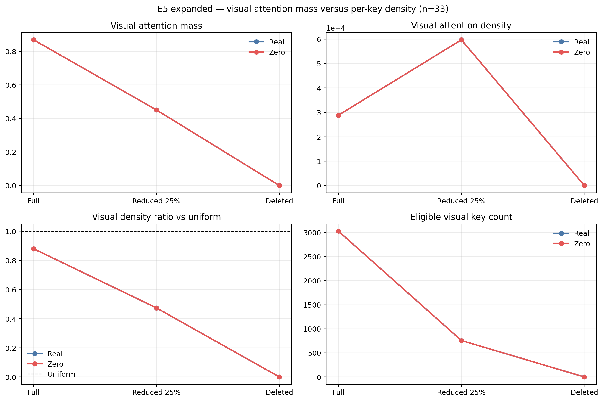

*Hình E5. Density bổ sung cho mass và effective-key count. Real/Zero chồng khít trong cả bốn panel; Reduced có density visual cao hơn Full dù raw visual mass thấp hơn.*

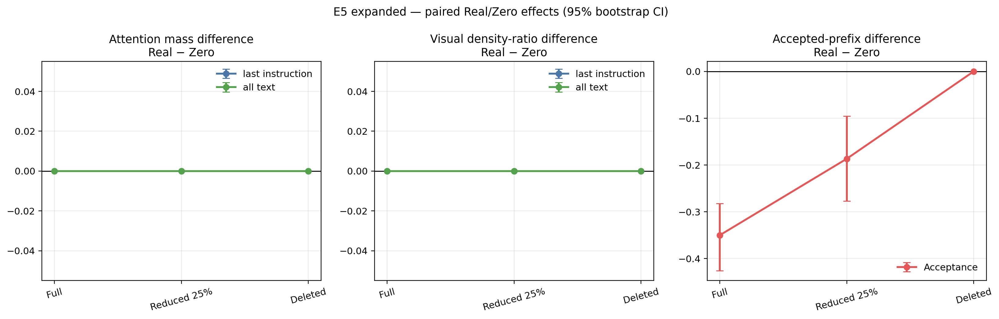

*Hình E5b. Paired Real − Zero differences với bootstrap 95% CI. Attention mass/density bằng 0 tuyệt đối trong mọi cặp; acceptance thì không tương đương ở Full và Reduced.*

Vì vậy, câu “Real và Zero cho kết quả như nhau” chỉ đúng cho **attention allocation**: mọi nhóm condition × policy có 33/33 cặp bằng nhau tuyệt đối, max absolute difference bằng `0` cho mass, density và density ratio. Câu này không đúng cho **acceptance**: mean accepted-prefix tokens của Real/Zero là Full `1.2285/1.5785`, Reduced-25% `2.2373/2.4240`, Deleted `2.6649/2.6649`; paired mean Real − Zero lần lượt `−0.3500` (95% CI `[-0.4259,-0.2820]`), `−0.1867` (CI `[-0.2772,-0.0953]`) và `0`.

Acceptance không tương đương ở Full/Reduced: chỉ 1/33 cặp Full và 2/33 cặp Reduced có cùng accepted-prefix value; Deleted là 33/33. Lossless rate Real/Zero lần lượt là Full `30/33` và `31/33`, Reduced `30/33` và `32/33`, Deleted `31/33` và `31/33`. Đây vẫn là draft–target alignment, không phải answer accuracy.

Các file paired và thống kê đầy đủ: [attention pairs](../../results/hypothesis_validation_gpu_20260911_e5_density/analysis/e5_attention_pairs.csv), [acceptance pairs](../../results/hypothesis_validation_gpu_20260911_e5_density/analysis/e5_acceptance_pairs.csv), [E5 expanded statistics](../../results/hypothesis_validation_gpu_20260911_e5_density/analysis/e5_expanded_statistics.json). Pilot E5 cũ `n=2` không được đưa vào phần hình hoặc kết luận thống kê; artifact gốc chỉ được giữ ngoài báo cáo để truy vết.

#### E1–E3: bằng chứng Qwen2/MSD cũ

Ở length sweep, giữ visual làm `accepted_prefix_tokens` giảm khi visual context dài hơn, trong khi remove-all tăng:

Mean curves của length sweep được chuyển sang panel Length trong [Hình E1–E2](figures/qwen2_msd_sweeps.png); SD, 95% CI, `n` và lossless rate được lưu nguyên dạng trong [figure1a_statistics.csv](../../results/sparrow_validation_qwen2vl_final_20260819/figure1a_statistics.csv). Các điểm biên để đọc nhanh là `k=2.45` (Keep) so với `2.65` (Remove) tại 400 tokens, và `1.28` so với `3.87` tại 25K tokens.

Ở retention sweep, `k` tăng gần đơn điệu khi retention giảm:

Mean curves của hai query policy và sáu retention level được trình bày ở panel Retention trong [Hình E1–E2](figures/qwen2_msd_sweeps.png); full statistics nằm trong [figure1b_statistics.csv](../../results/sparrow_validation_qwen2vl_final_20260819/figure1b_statistics.csv). Tóm tắt: mean `k` của `last_instruction` tăng từ `1.2934` ở 100% lên `3.8747` ở 0%; `all_text` cũng tăng từ `1.2897` lên `3.8692`.

Attention tại `last_instruction` trong length sweep cũng chuyển mạnh về visual khi context dài: visual/text/instruction mass lần lượt là `0.4051/0.4073/0.1876` ở 400 tokens, `0.8548/0.0986/0.0466` ở 3K, và `0.9955/0.0016/0.0029` ở 25K.

E3 có ba mức visual length; các mean và 95% CI được giữ trong [figure2_statistics.csv](../../results/sparrow_validation_qwen2vl_final_20260819/figure2_statistics.csv). Xu hướng chính là visual mass tăng từ `0.4051` ở 400 tokens lên `0.9955` ở 25K, đồng thời text mass giảm từ `0.4073` xuống `0.0016`.

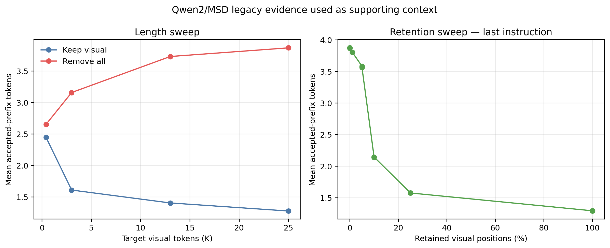

*Hình 4. E1–E2: evidence hỗ trợ rằng visual context dài có thể làm draft–target agreement thấp hơn. Đây là artifact Qwen2/MSD cũ và vẫn là alignment evidence.*

#### E6: full attention mass trên VDC50 và MVBench

Full H1b có thiết kế `3 visual conditions × 2 value modes × 2 query policies`. VDC50 có 600 dòng (`50 × 12`), MVBench có 12.000 dòng (`1.000 × 12`); không có error row, mỗi sample có đủ 12 cấu hình.

Mean attention mass theo dataset, condition và cả hai query policy được trình bày trong [Hình H1b attention allocation](figures/h1b_attention_mass.png); các JSONL nguồn giữ từng dòng raw và thống kê nhóm, gồm SD và `n`. Với query `last_instruction`, paired text-mass difference so với Full là:

| Dataset | Reduced − Full | 95% CI | Deleted − Full | 95% CI |
|---|---:|---|---:|---|
| VDC50 | +0.1441 | [0.1181, 0.1729] | +0.5972 | [0.5553, 0.6367] |
| MVBench | +0.0811 | [0.0796, 0.0827] | +0.2084 | [0.2061, 0.2107] |

Kết quả `all_text` cũng cùng hướng: VDC50 đạt text mass `0.4162 → 0.7810` từ Full đến Deleted, còn MVBench đạt `0.4605 → 0.6421`.

Mean top-five text-token mass tăng từ `0.0517` lên `0.3256` trên VDC50 và từ `0.2127` lên `0.3009` trên MVBench khi chuyển Full → Deleted. Đây là chỉ báo concentration, nhưng chưa phải hidden-OOD measure.


*Hình 5. H1b full-run: mỗi panel tách dataset và query policy; các thanh thể hiện visual/text/instruction attention mass. `instruction` là vùng user-text sau visual, thường chứa câu hỏi; `text` là phần còn lại trong causal key scope và có thể gồm token template/special token. Vì vậy chênh lệch Full–Reduced–Deleted phải được diễn giải là thay đổi giữa visual positions và residual non-visual keys, không phải trực tiếp là thay đổi attention vào question words.*

#### E5–E6: visual-value control

Zeroing visual values nhưng giữ visual positions không làm thay đổi attention allocation: maximum absolute difference giữa real và zero attention mass bằng `0` trong các cặp full-run.

| Dataset | Condition | Mean max abs(Δ logit) | Forward KL | Reverse KL | Top-1 match |
|---|---|---:|---:|---:|---:|
| VDC50 | Full | 1.1622 | 0 | 0 | 100% |
| VDC50 | Reduced 25% | 0.5830 | 0 | 0 | 100% |
| VDC50 | Deleted | 0.0000 | 0 | 0 | 100% |
| MVBench | Full | 0.2176 | 0 | 0 | 100% |
| MVBench | Reduced 25% | 0.2199 | 0 | 0 | 100% |
| MVBench | Deleted | 0.0000 | 0 | 0 | 100% |


*Hình 6. Zero visual values có thể làm thay đổi draft logits dù attention weights giữ nguyên. KL bằng 0 ở đây bị saturation do greedy distribution quá peaked; không được đọc là “value không có ảnh hưởng”. Đồng thời, `text_mass` trong các record là residual key mass theo mask của E6, không phải question-only mass; kết luận về value contribution vì thế phải dựa vào logit delta/top-1 control, không dựa vào tên nhóm `text`.*

#### E8: Qwen2.5/DFlash legacy diagnostic

E8 là evidence hỗ trợ cũ cho H1b, nhưng provenance khác với E6: target là Qwen2.5-VL-3B, drafter là DFlash và bundle không đạt coverage/losslessness gate. Toàn bộ primary bundle có `41,330` rows; length có 200 rows (199 audited-valid), retention 300 rows, context-attention 40,830 rows và layer diagnostics 3,950 rows. Audit ghi nhận 413 mismatches và 1 unsupported row.

Length sweep được chuyển sang [Hình E8-length](figures/figure1a_dflash_length_sweep.png); toàn bộ số liệu vẫn nằm trong [length_summary.csv](../../results/DFlash_Qwen2.5VL3B_report/length_summary.csv). Xu hướng endpoint là mean `τ` giảm từ `2.5595` ở 400 tokens xuống `2.1354` ở 25K, còn speedup giảm từ `1.8969` xuống `1.3178`.

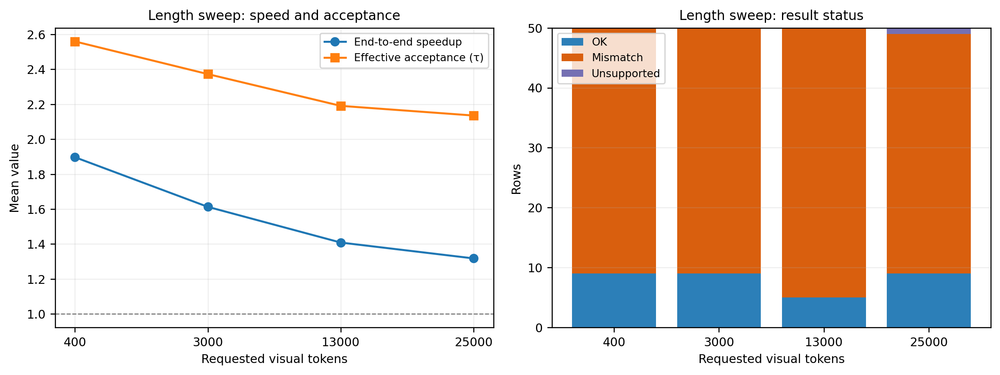

*Hình E8.1. Length sweep của artifact DFlash legacy.*

Retention sweep được chuyển sang [Hình E8-retention](figures/figure1b_dflash_retention.png); toàn bộ số liệu vẫn nằm trong [retention_summary.csv](../../results/DFlash_Qwen2.5VL3B_report/retention_summary.csv). Mean `τ` chỉ dao động `2.3126–2.3841`, còn speedup `1.5843–1.6121` trong các mức retention:

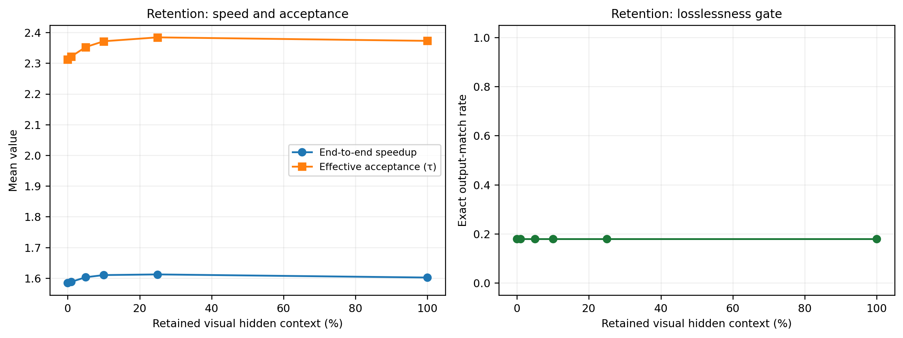

*Hình E8.2. Retention sweep của artifact DFlash legacy.*

Context-attention diagnostic được chuyển sang [Hình E8-context-attention](figures/figure2_dflash_context_attention.png); toàn bộ các layer/visual-length rows nằm trong [attention_summary.csv](../../results/DFlash_Qwen2.5VL3B_report/attention_summary.csv). Có 4,006 records tại 400 visual tokens và 4,160 records tại 3,000 visual tokens cho mỗi layer index.

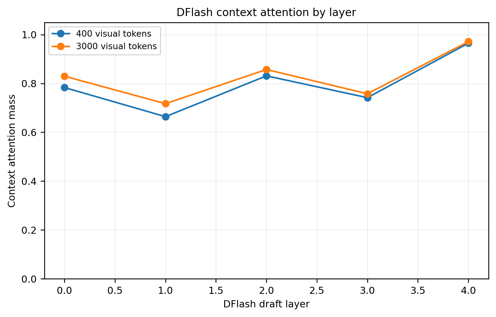

*Hình E8.3. Context-attention diagnostic theo layer của artifact DFlash legacy.*

E8 phù hợp với xu hướng visual context dài làm acceptance giảm và speedup giảm, nhưng do mismatch/unsupported/coverage gate false nên chỉ là exploratory evidence, không được dùng để xác nhận H1b hoặc so sánh trực tiếp với E6.

Nguồn số liệu E8: [length summary](../../results/DFlash_Qwen2.5VL3B_report/length_summary.csv), [retention summary](../../results/DFlash_Qwen2.5VL3B_report/retention_summary.csv) và [context-attention summary](../../results/DFlash_Qwen2.5VL3B_report/attention_summary.csv).

#### Kết luận H1b

H1b **được hỗ trợ ở cấp attention allocation**, với full-run trên hai dataset và paired confidence intervals. Dữ liệu chưa đủ để khẳng định đầy đủ trade-off “giữ hết gây dilution, xoá hết gây over-attention” vì:

1. attention mass chỉ cho biết allocation, không cho biết visual mass đó hữu ích hay có hại;
2. acceptance trong các sweep cũ tăng đơn điệu khi xoá visual, chưa cho thấy inverted-U;
3. chưa có answer accuracy/quality cùng prompt;
4. hidden-state comparison với training distribution chưa chạy;
5. KL greedy bị saturation, cần logit margin hoặc temperature/float64 diagnostic nhạy hơn.

## 4. Q2 — VDC và H2.1: prompt có answer semantics hay không?

### 4.1. Phát biểu và decision rule

H2.1 đặt câu hỏi liệu visual deletion trên VDC không tốt hơn baseline vì prompt tự nhiên chưa chứa answer semantics. `Answer-hint` nối reference answer vào prompt để tạo một oracle leakage control.

| Quan sát sau khi thêm answer hint | Diễn giải |
|---|---|
| Accuracy của Deleted gần Full hơn và khoảng cách Deleted–Full giảm so với Natural | Hỗ trợ rằng answer semantics trong prompt làm visual information ít cần hơn |
| Acceptance interaction giảm nhưng accuracy chưa đo được | Chỉ là tín hiệu alignment cùng hướng; chưa đủ xác nhận |
| Answer hint không làm giảm deletion gap, hoặc Deleted vẫn cần visual để đúng answer | Không hỗ trợ hypothesis |

Acceptance được dùng ở đây chỉ như diagnostic vì answer-hint làm thay đổi cả target prompt và target continuation.

### 4.2. Thực nghiệm E7 đã chạy

Thiết kế factorial đầy đủ trên VDC50:

`prompt variant ∈ {Natural, Answer-hint}` × `visual retention ∈ {Full, Reduced 25%, Deleted}`.

Mỗi prompt variant có 150 dòng (`50 × 3`), có 150/150 paired keys, không có error row và target-prefill parity hợp lệ.

| Prompt | Retention | n | Mean `k` | SD(`k`) | Min–max |
|---|---:|---:|---:|---:|---:|
| Natural | Full | 50 | 1.1600 | 0.6008 | 0.5714–3.2500 |
| Natural | Reduced 25% | 50 | 1.7471 | 0.6981 | 0.7105–3.2500 |
| Natural | Deleted | 50 | 2.6986 | 0.4273 | 1.7083–4.1538 |
| Answer-hint | Full | 50 | 1.1898 | 0.5056 | 0.7105–2.4737 |
| Answer-hint | Reduced 25% | 50 | 1.6345 | 0.5932 | 0.8333–2.8235 |
| Answer-hint | Deleted | 50 | 2.4509 | 0.3187 | 1.9130–3.1875 |

Gain Deleted − Full là `+1.5386` với Natural và `+1.2611` với Answer-hint. Factorial interaction trên metric này là `−0.2776`, bootstrap 95% CI `[−0.4094, −0.1411]`: answer hint làm deletion gain nhỏ hơn, nhưng không làm gain biến mất.

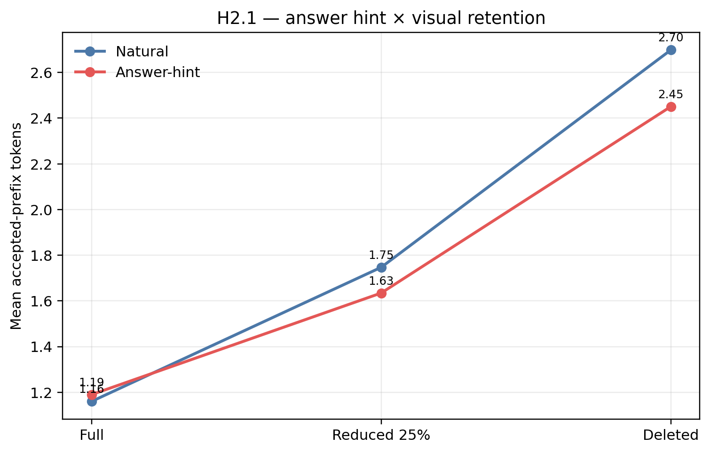

*Hình 7. H2.1 full-run: cả hai prompt variant đều có accepted-prefix tokens cao hơn khi visual positions bị xoá; đường Answer-hint thấp hơn ở Reduced/Deleted nhưng vẫn cùng xu hướng.*

Lossless rate và lossless-prefix statistics đầy đủ là:

| Prompt | Retention | Lossless | Mean lossless-prefix length |
|---|---:|---:|---:|
| Natural | Full | 46/50 (92%) | 59.86 |
| Natural | Reduced 25% | 46/50 (92%) | 60.54 |
| Natural | Deleted | 47/50 (94%) | 60.96 |
| Answer-hint | Full | 44/50 (88%) | 59.72 |
| Answer-hint | Reduced 25% | 45/50 (90%) | 59.84 |
| Answer-hint | Deleted | 47/50 (94%) | 62.14 |

Tuy nhiên cả 150 target output hashes đều khác giữa Natural và Answer-hint vì prompt đã thay đổi.

### 4.3. Kết luận H2.1

H2.1 **chưa được xác nhận**. Có một interaction âm trên acceptance, nghĩa là answer hint làm giảm deletion gain theo alignment metric; nhưng visual deletion vẫn làm acceptance tăng trong cả hai variant, và chưa có answer accuracy hoặc ground-truth quality. Vì vậy không thể kết luận rằng VDC không cần visual information để trả lời, cũng không thể kết luận rằng cut tốt hơn baseline về chất lượng.

### 4.4. E7-DFlash bổ sung: answer-hint và attention allocation

Đây là run độc lập trên đúng pipeline DFlash của workspace, với target
`Qwen/Qwen2.5-VL-3B-Instruct` và checkpoint local
`qwen25vl-3b-dflash-20e-llava68k-latest`. Thiết kế factorial là
`Natural/Answer-hint × Full/Reduced25/Deleted` trên VDC50; target luôn giữ
full visual input, còn intervention chỉ áp dụng lên DFlash target-hidden
context. First-prefill attention được ghi ở 5 DFlash layers, sau đó gom theo
`visual`, `question_text`, `answer_hint` và báo cáo đồng thời raw mass, số key,
density (`mass / số key`) và density-ratio so với phân bố đều trên context.

Run cuối có `300/300` dòng hợp lệ (`50 × 2 × 3`), `0` runtime-error row,
`150/150` dòng answer-hint có span token hợp lệ và attention status `ok`. Chín
dòng của ba mẫu có answer dài được rerun do BPE boundary; [merge manifest
provenance](../../results/e7_dflash_h3_20260911/e7_full_corrected/merge_manifest.json)
ghi rõ các dòng được thay thế.

Ở metric alignment `accepted_prefix_tokens`, Natural có mean lần lượt
`0.9382 / 0.9548 / 0.8658` cho Full/Reduced/Deleted; Answer-hint có
`1.0978 / 1.1517 / 1.1211`. Chênh lệch Deleted − Full là `−0.0724`, CI 95%
`[−0.1215, −0.0240]` với Natural và `+0.0233`, CI `[−0.0331, +0.0793]`
với Answer-hint. Interaction Answer-hint − Natural là `+0.0957`, CI 95%
`[+0.0302, +0.1542]`. Vì đây là draft–target agreement, không phải answer
accuracy, kết quả chỉ cho thấy oracle hint làm thay đổi deletion effect trên
alignment; nó chưa chứng minh chất lượng trả lời tốt hơn hoặc visual không còn
cần thiết.

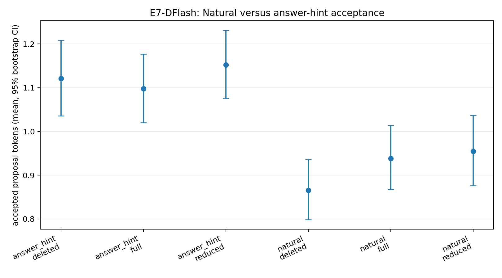

*Hình 9. E7-DFlash full-run: acceptance được trình bày theo hai prompt variant
và ba mức visual context; các error bar là bootstrap CI ở cấp sample.*

Attention allocation cho thấy raw mass phải được đọc cùng density. Với Natural,
visual mass giảm từ `0.4223` (Full) xuống `0.3134` (Reduced) rồi `0` (Deleted),
trong khi question-text mass tăng từ `0.0930` lên `0.1198` rồi `0.2020`.
Tuy nhiên visual density-ratio chỉ là `0.528 / 0.418 / 0` còn question-text
density-ratio là `18.755 / 6.450 / 0.526`; nghĩa là visual nhận nhiều tổng
mass chủ yếu vì có hàng nghìn key, không phải vì mỗi visual key được ưu tiên
hơn text key.

Với Answer-hint, hint raw mass là `0.2187 / 0.2813 / 0.3722` cho
Full/Reduced/Deleted, còn question-text mass là `0.0504 / 0.0592 / 0.0696`.
Nếu chỉ nhìn mass, có thể kết luận drafter tập trung vào hint. Density cho
kết luận thận trọng hơn: hint density-ratio là `7.531 / 2.837 / 0.637`, thấp
hơn question-text density-ratio `10.011 / 3.445 / 0.706` ở cả ba điều kiện.
Tỷ số density hint/question là `0.761 / 0.839 / 0.957` với CI 95% tương ứng
`[0.702, 0.826]`, `[0.774, 0.911]`, `[0.880, 1.037]`. Vì vậy raw hint mass
lớn phù hợp với confound “hint có nhiều token”; chưa có bằng chứng rằng mỗi
hint token được drafter ưu tiên mạnh hơn question token.

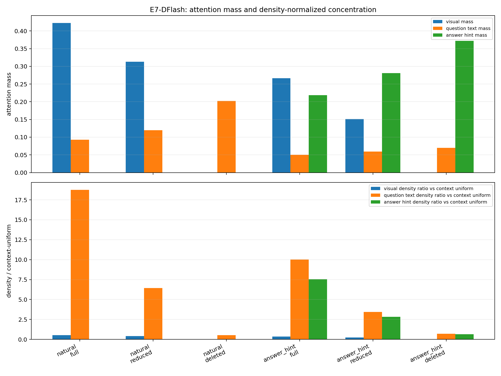

*Hình 10. E7-DFlash attention: mass và density-ratio được tách riêng để tránh
đọc nhầm hiệu ứng số lượng key thành mức độ ưu tiên trên từng token.*

Các [thống kê attention theo nhóm](../../results/e7_dflash_h3_20260911/analysis/e7_dflash_attention_group_statistics.csv),
[thống kê đầy đủ](../../results/e7_dflash_h3_20260911/analysis/e7_dflash_attention_statistics.csv)
và [summary JSON](../../results/e7_dflash_h3_20260911/analysis/summary.json)
được giữ dưới dạng artifact; các bảng dài không chèn trực tiếp vào báo cáo.

#### Kết luận H2.1 trên DFlash

E7-DFlash **hỗ trợ một phần ở mức alignment và attention allocation**, không
đủ để xác nhận H2.1 ở mức chất lượng trả lời. Answer-hint tạo interaction
dương so với Natural và làm deletion effect bớt âm, nhưng acceptance không
phải accuracy. Đồng thời density analysis bác bỏ cách diễn giải đơn giản rằng
hint có raw mass lớn thì từng hint token được ưu tiên hơn text token. Answer-hint
vẫn là oracle leakage diagnostic và làm thay đổi cả target prompt lẫn target
continuation; không được xem là phép đo benchmark độc lập.

## 5. Q3 — Vì sao acceptance thay đổi sau visual cut?

### 5.1. H3.1 — Acceptance gain có chỉ xuất hiện sau nửa câu trả lời?

#### Phát biểu và prediction

H3.1 dự đoán rằng trong nửa đầu target còn cần visual evidence nên visual cut làm acceptance thấp; sau khi một phần answer đã được sinh, context text đủ mạnh nên acceptance của cut tăng.

Decision statistic nên là:

\[
I = (\Delta_{late}) - (\Delta_{early}),
\]

trong đó `Δ` là acceptance(reduced/deleted) − acceptance(full), tính trên cùng backend và cùng cohort. Nếu `I > 0` ổn định, H3.1 được hỗ trợ. Nếu gain đã xuất hiện ở các bin đầu hoặc dấu đổi giữa backend, H3.1 chưa được xác nhận.

#### E9 — MSD pilot `n=2`: loại khỏi bằng chứng định lượng

Position pilot MSD trên VDC@3K chỉ có `n=2`. Vì vậy các hình có chứa pilot
này — gồm hình position-wise cũ và hình provenance so sánh MSD với DFlash —
được loại khỏi báo cáo chính. Các artifact gốc vẫn giữ trong workspace để
truy vết, nhưng không được dùng để ước lượng CI, kiểm định H3.1 hoặc minh hoạ
xu hướng theo answer position.

Nếu muốn nghiên cứu riêng tại mốc khoảng 3K visual tokens, cần chạy lại trên
một cohort nhiều mẫu. Mốc thực dụng hiện có là cohort E5 với `n=33`; tốt hơn
là chạy toàn bộ VDC50 nếu chi phí cho phép. Phải ghi rõ `n`, denominator theo
từng position bin và bootstrap CI. Không được gọi kết quả mới đó là mở rộng
của pilot `n=2` nếu protocol, cohort hoặc backend thay đổi.

#### H3.1-DFlash full bổ sung trên VDC50

Để bổ sung bằng chứng, không thay thế hay gộp với MSD pilot `n=2`, tôi đã
chạy target/checkpoint DFlash trên toàn bộ 50 sample của VDC50, ba condition
`Full/Zero/Cut`, với 64 answer
tokens tối đa: `150/150` rows, 50/50 sample IDs, 150 unique row IDs và 0
runtime-error row. Kết quả mean accepted proposal tokens là Full `0.9395`,
Zero `0.8249`, Cut `0.8657`. Đường cong theo vị trí được trình bày trong
[Hình H3.1-DFlash position acceptance](figures/h31_dflash_position_acceptance.png);
hình [position-wise contrast versus Full](figures/h31_dflash_position_delta.png)
trình bày trực tiếp `Zero−Full` và `Cut−Full` theo từng bin. CSV đầy đủ gồm
`n` và bootstrap 95% CI ở [position statistics](../../results/e7_dflash_h3_20260911/h31_full/analysis/h31_dflash_position_statistics.csv)
và [position-delta statistics](../../results/e7_dflash_h3_20260911/h31_full/analysis/h31_dflash_position_delta_statistics.csv).

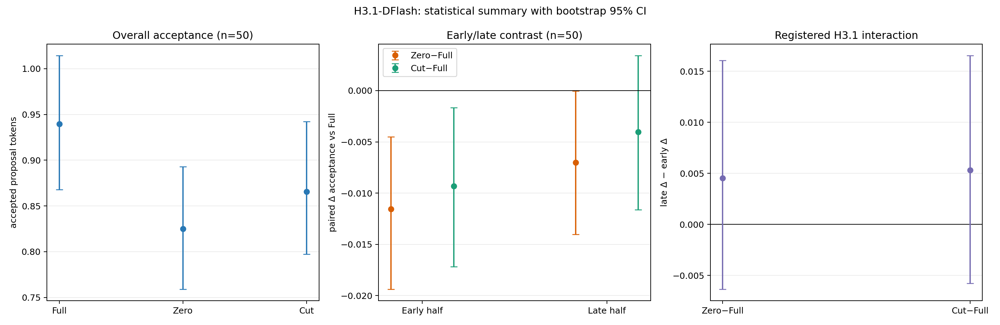

*Hình H3.1c. Hình thống kê ở cấp sample (`n=50`): acceptance tổng thể theo
điều kiện, paired delta ở nửa đầu/nửa sau, và decision statistic
`late_delta−early_delta`. Error bars là bootstrap 95% CI; hai interaction CI
đều cắt đường 0.*

Interaction đã đăng ký trước là `late_delta − early_delta`. Với Cut so với
Full, estimate `+0.0053`, CI 95% `[-0.0058, +0.0165]`; với Zero so với Full,
estimate `+0.0045`, CI 95% `[-0.0063, +0.0160]`. Cả hai CI đều chứa 0, nên
H3.1 không được hỗ trợ trên DFlash full: run này không cho thấy acceptance
gain chỉ xuất hiện sau nửa câu. Đây là kết luận cho DFlash backend và cohort
VDC50 `n=50`; MSD position pilot cũ vẫn là exploratory `n=2`, không thể dùng
để thay thế hoặc gộp vào kết luận này.

[Raw H3.1-DFlash journal](../../results/e7_dflash_h3_20260911/h31_full/h3_1_dflash.jsonl)
và [H3.1-DFlash analysis](../../results/e7_dflash_h3_20260911/h31_full/analysis/summary.json)
được giữ riêng để không gộp với MSD artifact.

#### Kết luận H3.1

H3.1 **chưa được xác nhận ở mức tổng quát**. Study DFlash full đã có `n=50`
và bootstrap CI, nhưng early/late interaction không khác 0; MSD/Qwen2-VL-7B
pilot gốc vẫn chỉ có `n=2` và khác backend. Kết luận có hiệu lực hiện tại là:
không quan sát được late-only gain trên DFlash full, còn MSD pilot chưa đủ cỡ
mẫu để quyết định mẫu hình theo vị trí. Cần chạy full position study trên MSD
gốc nếu muốn kết luận cho backend MSD.

### 5.2. H3.2 — Drafter nhiều layer có hiểu visual tốt hơn không?

#### Câu hỏi, giả thuyết và decision rule

H3.2 hỏi liệu tăng số draft layer từ 1 lên 3 có làm drafter khai thác visual
hidden tốt hơn hay không; depth5 là mở rộng để kiểm tra xu hướng có tiếp tục
hay không. “Hiểu visual tốt hơn” trong phép đo hiện tại được vận hành hoá
bằng độ nhạy của acceptance đối với visual values, không phải answer accuracy
trực tiếp.

Với mỗi sample, điều kiện `Full` giữ cả visual positions và visual values,
`Zero` giữ positions nhưng đặt visual values bằng 0, còn `Cut` loại positions.
Contrast chính là:

```text
S_depth = τ_eff(Full) − τ_eff(Zero)
I = S_depth3 − S_depth1
```

`I > 0` nhất quán được xem là bằng chứng rằng depth3 khai thác visual values
nhiều hơn depth1 trong cùng corpus; `I ≈ 0` không cho thấy lợi ích depth; và
`I < 0` là kết quả ngược với H3.2. `Full−Cut` chỉ là contrast phụ vì nó đồng
thời thay đổi độ dài context và mẫu số attention.

#### E10 — depth-controlled DFlash

Target được giữ cố định là `Qwen/Qwen2.5-VL-3B-Instruct`. Chỉ thay draft
checkpoint giữa các depth; depth3−depth1 là contrast chính đã đăng ký, còn
depth5−depth1 là mở rộng exploratory. Checkpoint depth1/depth3 được tải từ
[Tphuc15/qwen25vl-3b-depth1-depth3](https://huggingface.co/datasets/Tphuc15/qwen25vl-3b-depth1-depth3).
Checkpoint depth5 (6e) được tải từ dataset
[Tphuc15/vdflash-qwen25vl-3b-checkpoints](https://huggingface.co/datasets/Tphuc15/vdflash-qwen25vl-3b-checkpoints).
Hai corpus huấn luyện được phân tích riêng:

- `llava68k`: depth1 và depth3 cùng `global_step=6375`, epoch 6;
- `sharegpt68k`: depth1 và depth3 cùng `global_step=6129`, epoch 5.

Các checkpoint đều dùng target layer IDs `(1, 9, 17, 25, 33)`, hidden size
2048 và feature dimension 10240. Depth1 có 1 draft layer, depth3 có 3 draft
layers và depth5 có 5 draft layers.

Mỗi cell dùng cùng 50 sample VDC, ba condition `Full/Zero/Cut`, và target
output được cache để bảo đảm đối chiếu acceptance không bị thay đổi bởi
target decoding. Với depth5, mỗi corpus thêm `150` rows; tổng cộng VDC có
`900/900` rows hợp lệ, không có runtime error. Bootstrap 95% CI được resample ở cấp sample, ghép cặp theo
`sample_id`; không coi token hoặc speculative round là các quan sát độc lập.

#### Kết quả VDC

Kết quả `Full−Zero` — contrast chính của visual-value sensitivity — như sau:

| Training corpus | Depth | n | Mean `Full−Zero` | Bootstrap 95% CI |
|---|---:|---:|---:|---:|
| LLaVA68K | 1 | 50 | +0.0275 | [+0.0001, +0.0545] |
| LLaVA68K | 3 | 50 | +0.1536 | [+0.1036, +0.2059] |
| LLaVA68K | 5 | 50 | +0.1075 | [+0.0448, +0.1690] |
| ShareGPT68K | 1 | 50 | −0.0173 | [−0.0318, −0.0043] |
| ShareGPT68K | 3 | 50 | −0.0713 | [−0.0997, −0.0412] |
| ShareGPT68K | 5 | 50 | −0.0540 | [−0.0826, −0.0261] |

Pairwise depth interaction:

| Training corpus | Contrast | n | Interaction | Bootstrap 95% CI | Đọc kết quả |
|---|---:|---:|---:|---|
| LLaVA68K | `D3−D1` (primary) | 50 | **+0.1261** | **[+0.0672, +0.1888]** | Ủng hộ H3.2 |
| LLaVA68K | `D5−D1` (exploratory) | 50 | **+0.0799** | **[+0.0105, +0.1532]** | Cùng chiều H3.2 |
| LLaVA68K | `D5−D3` (exploratory) | 50 | **−0.0461** | **[−0.1129, +0.0206]** | Chưa khác 0 |
| ShareGPT68K | `D3−D1` (primary) | 50 | **−0.0540** | **[−0.0912, −0.0155]** | Ngược chiều H3.2 |
| ShareGPT68K | `D5−D1` (exploratory) | 50 | **−0.0367** | **[−0.0707, −0.0039]** | Cùng hướng phản chứng |
| ShareGPT68K | `D5−D3` (exploratory) | 50 | **+0.0173** | **[−0.0126, +0.0471]** | Chưa khác 0 |

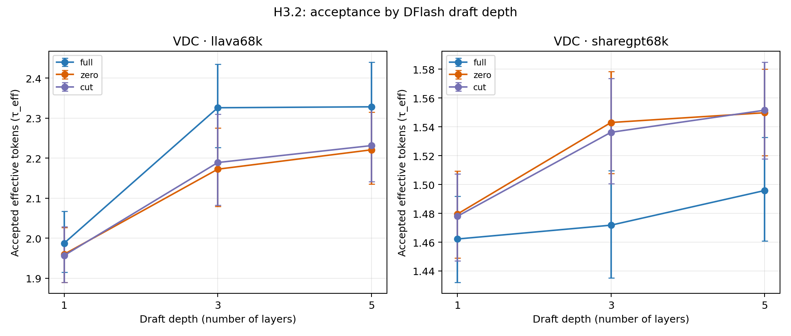

*Hình H3.2a. `τ_eff` tuyệt đối theo depth1/3/5. Hình cho thấy mức acceptance, nhưng
không nên dùng một mình để suy ra visual understanding vì các depth có thể có
baseline acceptance khác nhau.*

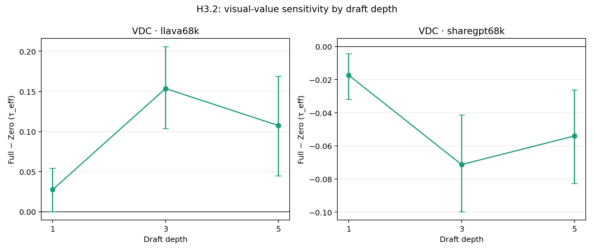

*Hình H3.2b. Contrast `Full−Zero` theo depth1/3/5. Đây là hình trực tiếp cho biết
việc giữ visual values làm thay đổi acceptance bao nhiêu; dấu của contrast
khác nhau giữa hai corpus.*

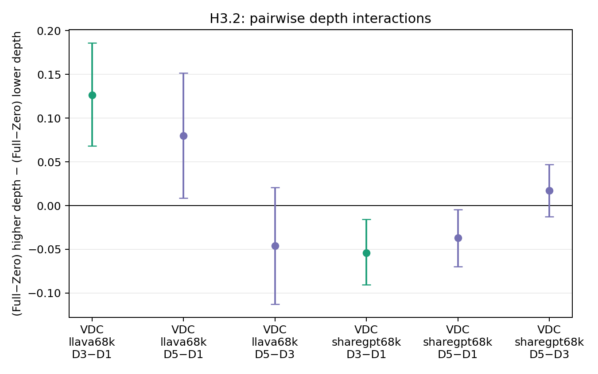

*Hình H3.2c. Difference-in-differences theo từng cặp depth (`D3−D1`, `D5−D1`
và `D5−D3`); error bar là bootstrap 95% CI ở cấp sample. `D5−D3` có CI đều
cắt 0 ở cả hai corpus, nên chưa có bằng chứng rằng depth5 khác depth3 về
visual-value sensitivity; hướng tổng thể vẫn phụ thuộc corpus.*

Các hình và số liệu trên chỉ đo acceptance/alignment. E10 hiện **chưa capture
attention map**, chưa đo answer accuracy và chưa đo hidden-state OOD; vì vậy
chưa thể nói depth3 hoặc depth5 “hiểu visual” tốt hơn theo nghĩa chất lượng
câu trả lời.

#### MVBench: đang chạy, chưa đưa vào kết luận

MVBench được cấu hình với 1.000 mẫu, 8 frames và pixel budget cố định
`200704`; toàn bộ study cần `12,000` rows (`4` corpus×depth cells × `1,000`
sample × `3` conditions). Tại thời điểm cập nhật báo cáo, run
`llava68k/depth1` mới ở mức khoảng `2.5K/3,000` rows hợp lệ (hơn 800 sample);
ba run còn lại chưa hoàn tất. Do đó không sử dụng các rows MVBench hiện tại
để tính interaction hoặc để thay đổi kết luận VDC.

Runner vẫn đang tiếp tục trong background; log và raw journal được liệt kê ở
Artifact index. Khi đủ coverage, cần chạy lại analyzer trên cả bốn journal và
chỉ khi đó mới bổ sung MVBench vào phần kết luận H3.2.

#### Kết luận H3.2 hiện tại

H3.2 được **hỗ trợ có điều kiện trên VDC/LLaVA68K** ở contrast
`Full−Zero`, nhưng bị **phản chứng trên VDC/ShareGPT68K** với cùng contrast.
Kết quả cho thấy corpus huấn luyện tương tác mạnh với depth; dữ liệu hiện tại
không hỗ trợ mệnh đề tổng quát “tăng depth luôn làm drafter đọc visual tốt hơn”.
MVBench chưa hoàn tất, và chưa có attention/accuracy evidence để nâng diễn
giải từ visual-value sensitivity lên visual understanding.

## 6. Tổng hợp kết luận theo hypothesis

| Hypothesis | Kết luận | Bằng chứng trực tiếp | Giới hạn |
|---|---|---|---|
| H1a: text over-attention gây hidden OOD | Chưa kiểm chứng | Text mass/top-token concentration tăng sau deletion | Thiếu training hidden mean/covariance; chưa đo quality/OOD |
| H1b: dilution ↔ over-attention | Hỗ trợ cơ học attention | H1b full trên VDC50/MVBench; paired mass shift; zero-value control | Chưa có inverted-U accuracy/quality; KL saturation |
| H2.1: answer semantics làm visual deletion ít hại hơn | Chưa xác nhận | MSD có interaction âm; DFlash có interaction dương nhưng CI của riêng Answer-hint chứa 0; attention density đã được kiểm tra | Acceptance không phải accuracy; target continuation đã đổi; kết quả phụ thuộc backend |
| H3.1: gain chỉ xuất hiện sau nửa câu | Chưa xác nhận ở mức tổng quát | DFlash/Qwen2.5-VL-3B full VDC50 `n=50`; early/late CI chứa 0 | MSD/Qwen2-VL-7B pilot gốc vẫn `n=2`; DFlash full không cho late-only gain; hai study không pool |
| H3.2: nhiều layer đọc visual tốt hơn | Có bằng chứng trái chiều | E10 VDC50: primary `D3−D1` là `+0.1261` (LLaVA) và `−0.0540` (ShareGPT); exploratory `D5−D1` là `+0.0799` và `−0.0367`; `D5−D3` lần lượt `−0.0461` và `+0.0173`, đều có CI cắt 0 | MVBench chưa đủ coverage; chưa có attention/accuracy/OOD |

## 7. Phân loại phần đã làm được và phần cần training data

| Hypothesis/thực nghiệm | Có cần training data không? | Đã chạy? | Ghi chú |
|---|---|---|---|
| H1a: training hidden mean/covariance và Mahalanobis/OOD | Có | Chưa | Workspace chỉ có test manifests/checkpoint, không có training examples hoặc hidden statistics |
| H1b: attention mass Full/Reduced/Deleted | Không | Đã chạy full | VDC50 600 dòng; MVBench 12.000 dòng |
| H1b: real-value/zero-value control và logit delta | Không | Đã chạy full | Attention unchanged; logits changed; KL greedy bị saturation |
| H2.1: Natural/Answer-hint × visual retention | Không | Đã chạy full | 50 sample × 2 prompt variants × 3 conditions; chỉ là alignment diagnostic |
| H3.1: position-wise acceptance | Không | DFlash/Qwen2.5-VL-3B full VDC50 đã chạy `n=50`; MSD/Qwen2-VL-7B pilot `n=2` bị loại | Muốn kết luận trên MSD@3K phải rerun nhiều mẫu, ưu tiên `n=33` hoặc toàn bộ VDC50; hai backend/cohort không gộp |
| H3.2: depth-controlled DFlash | Có | Đã chạy đủ VDC50 cho depth1/3/5; MVBench đang chạy | Depth5 đã bổ sung ở cả hai corpus; chưa capture attention/accuracy |

Như vậy, H1b, H2.1 và H3.1 về nguyên tắc có thể thực hiện không cần dữ liệu training. Tuy nhiên H3.1 vẫn chưa đạt mức bằng chứng quyết định vì cần cohort/backend đồng nhất; “không cần training data” không đồng nghĩa “đã đủ để kết luận”.

## 8. Các confound cần giữ trong báo cáo

- Một số VDC sample dài ở cuối H1b run phải dùng fallback `max_pixels=100352`; ba sample cuối trong nhóm fallback dùng thêm `max_frames=8`.
- MVBench H1b full-run dùng `max_frames=8`.
- Qwen2/MSD và Qwen2.5/DFlash khác model, tokenizer, checkpoint, preprocessing và runtime; không được gộp acceptance hoặc quality thành một benchmark. Ngay trong H3.1, MSD pilot và DFlash full cũng là hai study riêng.
- Answer-hint thay đổi target prompt, target continuation và output hash; nó không phải một intervention chỉ trên draft.
- `accepted_prefix_tokens` đo draft–target agreement; `lossless` chỉ là parity với target continuation cùng prompt, không phải khớp ground truth.
- Probability KL bằng 0 trong full-run là saturation diagnostic. Cần logit margin, top-k cumulative probability hoặc temperature calibration để thay thế.

## 9. Kế hoạch thực nghiệm tiếp theo theo hypothesis

1. **H1a — training-distribution reference:** lấy training cohort cùng preprocessing; lưu hidden state theo layer/token role; tính mean, covariance, Mahalanobis và so sánh Full/Reduced/Deleted. Đồng thời đo hidden norm, logit margin và answer accuracy.
2. **H1b — causal quality:** giữ full target context, chạy answer accuracy/ground-truth scoring cho Full/Reduced/Deleted; bổ sung value perturbation và KL ở temperature không bão hòa. Kiểm tra có thật sự tồn tại inverted-U hay chỉ là acceptance tăng đơn điệu.
3. **H2.1 — clean answer-hint factorial:** tách prompt leakage khỏi đánh giá quality bằng cách giữ target evaluation prompt cố định, hoặc đánh giá trên một continuation/reference protocol được khóa trước. So sánh accuracy gap và acceptance interaction cùng lúc.
4. **H3.1 — position study:** DFlash full VDC50 đã hoàn tất với `n=50`; phần còn thiếu là chạy cùng position protocol trên MSD/Qwen2-VL-7B ở nhiều mẫu tại mốc 3K (ưu tiên cohort `n=33` hoặc toàn bộ VDC50), ghi toàn bộ acceptance trace, first-reject position, target visual sensitivity theo answer position; báo cáo CI và interaction early/late. Không pool hai backend.
5. **H3.2 — depth study:** hoàn tất ba run MVBench còn lại, chạy paired analyzer trên đủ `12,000` rows; sau đó bổ sung attention mass, answer accuracy và cost. Depth5 VDC đã có, nhưng vẫn cần MVBench và nhiều seed nếu muốn khẳng định xu hướng ngoài cohort hiện tại.

## 10. Artifact index

### Hình sinh cho báo cáo

- [H1a layerwise proxy](figures/h1a_layerwise_proxy.png)
- [H1b attention mass](figures/h1b_attention_mass.png)
- [H1b visual-value ablation](figures/h1b_value_ablation.png)
- [E5 expanded attention density](figures/h1b_e5_attention_density.png)
- [E5 expanded paired Real/Zero](figures/h1b_e5_real_zero_paired.png)
- [H2.1 acceptance interaction](figures/h2_1_acceptance_interaction.png)
- [H3.1-DFlash full position acceptance](figures/h31_dflash_position_acceptance.png)
- [H3.1-DFlash full position delta versus Full](figures/h31_dflash_position_delta.png)
- [H3.1-DFlash statistical summary](figures/h31_dflash_statistical_summary.png)
- [H3.2 VDC acceptance by depth](figures/h32_acceptance_by_depth.png)
- [H3.2 VDC visual-value sensitivity](figures/h32_visual_sensitivity.png)
- [H3.2 VDC primary depth interaction](figures/h32_primary_depth_interaction.png)
- [E7-DFlash acceptance](figures/e7_dflash_acceptance.png)
- [E7-DFlash attention mass/density](figures/e7_dflash_attention_mass_density.png)
- [Qwen2/MSD legacy sweeps](figures/qwen2_msd_sweeps.png)
- [Figure manifest và source paths](../../results/hypothesis_report_figures_20260910/figure_manifest.json)

### Full H1b/H2.1 mới

- [H1b VDC part 1](../../results/h1b_h21_20260909/attention_kl_vdc50_part1_0_45.jsonl)
- [H1b VDC part 2](../../results/h1b_h21_20260909/attention_kl_vdc50_part2_45_47.jsonl)
- [H1b VDC part 3](../../results/h1b_h21_20260909/attention_kl_vdc50_part3_47_50.jsonl)
- [H1b MVBench chunk 000–100](../../results/h1b_h21_20260909/attention_kl_mvbench_000_100.jsonl)
- [H1b MVBench chunk 900–1000](../../results/h1b_h21_20260909/attention_kl_mvbench_900_1000.jsonl)
- [H2.1 Natural VDC50](../../results/h1b_h21_20260909/msd_natural_vdc50.jsonl)
- [H2.1 Answer-hint VDC50](../../results/h1b_h21_20260909/msd_answer_hint_vdc50.jsonl)
- [E5 expanded attention, Real/Zero, n=33](../../results/hypothesis_validation_gpu_20260911_e5_density/e5_attention_full_n33_corrected.jsonl)
- [E5 expanded acceptance, Real, n=33](../../results/hypothesis_validation_gpu_20260911_e5_density/e5_acceptance_real_n33.jsonl)
- [E5 expanded acceptance, Zero, n=33](../../results/hypothesis_validation_gpu_20260911_e5_density/e5_acceptance_zero_n33.jsonl)
- [E5 paired attention statistics](../../results/hypothesis_validation_gpu_20260911_e5_density/analysis/e5_attention_pairs.csv)
- [E5 paired acceptance statistics](../../results/hypothesis_validation_gpu_20260911_e5_density/analysis/e5_acceptance_pairs.csv)
- [E5 expanded statistics JSON](../../results/hypothesis_validation_gpu_20260911_e5_density/analysis/e5_expanded_statistics.json)
- [E5 selected cohort manifest](../../results/hypothesis_validation_gpu_20260911_e5_density/cohort33_manifest.jsonl)
- [E5 cohort selection/provenance](../../results/hypothesis_validation_gpu_20260911_e5_density/cohort33_selection.json)

### Artifact DFlash follow-up, legacy và provenance

- [Qwen2/MSD validated report](../../results/sparrow_validation_qwen2vl_final_20260819/REPORT.md)
- [DFlash legacy length figure](figures/figure1a_dflash_length_sweep.png)
- [DFlash legacy retention figure](figures/figure1b_dflash_retention.png)
- [DFlash legacy context-attention figure](figures/figure2_dflash_context_attention.png)
- [H3.1-DFlash full raw journal](../../results/e7_dflash_h3_20260911/h31_full/h3_1_dflash.jsonl)
- [H3.1-DFlash position statistics](../../results/e7_dflash_h3_20260911/h31_full/analysis/h31_dflash_position_statistics.csv)
- [H3.1-DFlash analysis summary](../../results/e7_dflash_h3_20260911/h31_full/analysis/summary.json)
- [H3.1-DFlash position delta statistics](../../results/e7_dflash_h3_20260911/h31_full/analysis/h31_dflash_position_delta_statistics.csv)
- [H3.2 VDC depth analysis summary](../../results/h32_depth_20260915/analysis_vdc/h32_summary.json)
- [H3.2 VDC group statistics](../../results/h32_depth_20260915/analysis_vdc/h32_group_statistics.csv)
- [H3.2 VDC paired statistics](../../results/h32_depth_20260915/analysis_vdc/h32_paired_statistics.csv)
- [H3.2 depth experiment progress report](../bao_cao_h32_depth_20260915.md)
- [H3.2 full-run script](../../scripts/run_h32_depth_full_20260915.sh)
- [E7-DFlash corrected raw journal](../../results/e7_dflash_h3_20260911/e7_full_corrected/e7_dflash.jsonl)
- [E7-DFlash repair provenance](../../results/e7_dflash_h3_20260911/e7_full_corrected/merge_manifest.json)
- [E7-DFlash attention statistics](../../results/e7_dflash_h3_20260911/analysis/e7_dflash_attention_group_statistics.csv)
- [E7-DFlash original full-run journal (provenance)](../../results/e7_dflash_h3_20260911/e7_full/e7_dflash.jsonl)
- [GPU validation summary 2026-09-08](../../results/hypothesis_validation_gpu_20260908/SUMMARY.md)
- [Qwen2.5/DFlash incomplete report](../../results/DFlash_Qwen2.5VL3B_report/REPORT_FINAL.md)
- [Position pilot summary](../../results/hypothesis_validation_gpu_20260907/SUMMARY.md)
- [Báo cáo H1b/H2.1 chi tiết](../bao_cao_h1b_h21_full_20260909.md)

### Artifact bị loại khỏi bằng chứng chính

- `h1b_zero_value_pilot.png`: E5 pilot cũ, `n=2`.
- `h3_1_position_acceptance.png`: hình H3.1 cũ chứa MSD position pilot, `n=2`.
- `h3_1_backend_cohort_provenance.png`: hình provenance có panel MSD pilot, `n=2`.
- `h3_dflash_position_acceptance.csv` và [MSD pilot summary](../../results/hypothesis_validation_gpu_20260907/SUMMARY.md): chỉ lưu để truy vết, không dùng cho kết luận thống kê.
