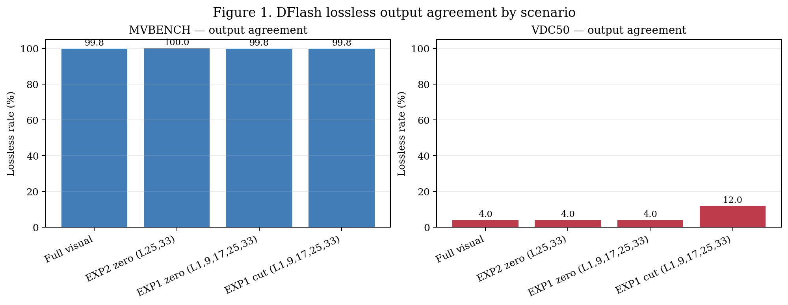
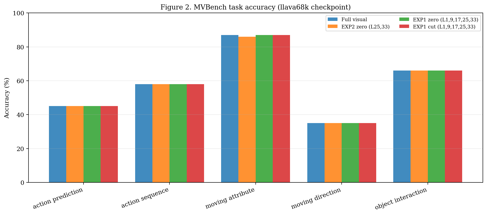
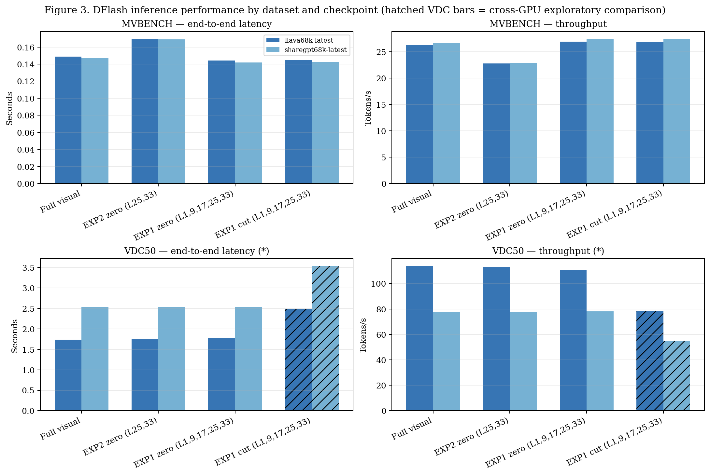
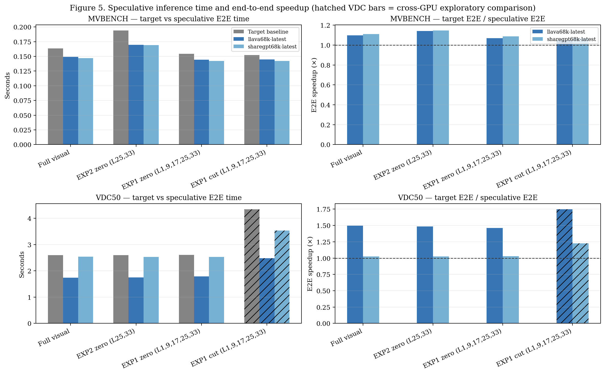
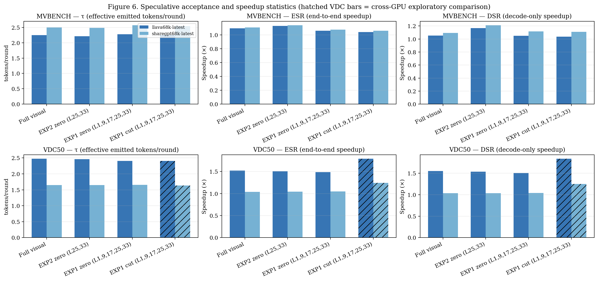
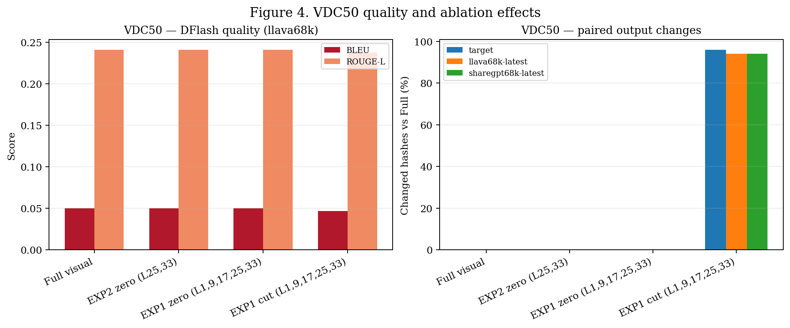

# Báo cáo tổng hợp DFlash Inference trên MVBench và VDC50

**Trạng thái vận hành:** `COMPLETED — diagnostic benchmark`

Báo cáo được sinh hoàn toàn từ các JSON artifact của các lần chạy đã hoàn tất; không chạy lại model/GPU và không sửa artifact gốc.

## Executive summary

- MVBench gồm 4 điều kiện, mỗi điều kiện 500 mẫu; VDC50 gồm 4 điều kiện, mỗi điều kiện 50 mẫu.
- Trên MVBench, accuracy khoảng 58.0–58.2%; các ablation gần như giữ nguyên output so với Full.
- Trên VDC50, hai điều kiện zero giữ nguyên output so với Full; cut thay đổi decoding rõ rệt và tăng lossless rate từ 4% lên 12%.
- Speculative metrics: MVBench có E2E speedup khoảng 1.05–1.15×, τ 2.21–2.57 token/round, ESR 1.04–1.14× và DSR 1.04–1.21×; VDC50 Full/zero có E2E speedup 1.02–1.50× trên cùng GPU.
- VDC cut chạy trên GPU khác với Full/zero, do đó các kết luận về speedup hoặc chất lượng của cut được giữ ở mức exploratory.

## Protocol và phạm vi

| Dataset | Số điều kiện | Mẫu/điều kiện | Frames | Output budget | Checkpoints |
|---|---:|---:|---:|---:|---|
| MVBench | 4 | 500 | 8 | 16 tokens | llava68k, sharegpt68k |
| VDC50 | 4 | 50 | 8 | 256 tokens | llava68k, sharegpt68k |

`Lossless` nghĩa là toàn bộ speculative output token trùng target output token ở cấp sample.

## Trực quan tổng quan

*Hình 1. Tỷ lệ output lossless của các checkpoint DFlash trên từng kịch bản.*

## 1. Kết quả theo từng kịch bản — MVBench

*Hình 2. Accuracy theo task của checkpoint llava68k trên MVBench; dùng để đối chiếu nhanh giữa các ablation.*

### 1.1 Full visual

- Mode: `full`; layers: `full visual context`.
- Device/dtype: `cuda:0` / `torch.bfloat16`; frames: `8`; output budget: `16`.
- Coverage: `500/500`; runtime errors: `0`; lossless: `499/500`; summary consistency: `True`.
- Performance comparability: `same-device comparison`.

| Model group | Accuracy | BLEU | ROUGE-L | τ | ESR | DSR | Tokens/s | E2E (s) | Speedup vs target (×) |
|---|---:|---:|---:|---:|---:|---:|---:|---:|---:|
| Target baseline | 58.2% | 0.593 | 0.224 | — | — | — | — | 0.163 | — |
| llava68k-latest | 58.2% | 0.592 | 0.225 | 2.248 | 1.093 | 1.052 | 26.209 | 0.149 | 1.093 |
| sharegpt68k-latest | 58.2% | 0.592 | 0.225 | 2.495 | 1.107 | 1.093 | 26.631 | 0.147 | 1.107 |

Task accuracy (target / llava68k):
- `action_prediction`: 45.0% / 45.0%
- `action_sequence`: 58.0% / 58.0%
- `moving_attribute`: 87.0% / 87.0%
- `moving_direction`: 35.0% / 35.0%
- `object_interaction`: 66.0% / 66.0%

### 1.2 EXP2 zero (L25,33)

- Mode: `zero`; layers: `[25, 33]`.
- Device/dtype: `cuda:0` / `torch.bfloat16`; frames: `8`; output budget: `16`.
- Coverage: `500/500`; runtime errors: `0`; lossless: `500/500`; summary consistency: `True`.
- Performance comparability: `same-device comparison`.

| Model group | Accuracy | BLEU | ROUGE-L | τ | ESR | DSR | Tokens/s | E2E (s) | Speedup vs target (×) |
|---|---:|---:|---:|---:|---:|---:|---:|---:|---:|
| Target baseline | 58.0% | 0.597 | 0.219 | — | — | — | — | 0.194 | — |
| llava68k-latest | 58.0% | 0.597 | 0.219 | 2.211 | 1.128 | 1.167 | 22.757 | 0.170 | 1.128 |
| sharegpt68k-latest | 58.0% | 0.597 | 0.219 | 2.485 | 1.138 | 1.211 | 22.901 | 0.169 | 1.138 |

Task accuracy (target / llava68k):
- `action_prediction`: 45.0% / 45.0%
- `action_sequence`: 58.0% / 58.0%
- `moving_attribute`: 86.0% / 86.0%
- `moving_direction`: 35.0% / 35.0%
- `object_interaction`: 66.0% / 66.0%

### 1.3 EXP1 zero (L1,9,17,25,33)

- Mode: `zero`; layers: `[1, 9, 17, 25, 33]`.
- Device/dtype: `cuda:0` / `torch.bfloat16`; frames: `8`; output budget: `16`.
- Coverage: `500/500`; runtime errors: `0`; lossless: `499/500`; summary consistency: `True`.
- Performance comparability: `same-device comparison`.

| Model group | Accuracy | BLEU | ROUGE-L | τ | ESR | DSR | Tokens/s | E2E (s) | Speedup vs target (×) |
|---|---:|---:|---:|---:|---:|---:|---:|---:|---:|
| Target baseline | 58.2% | 0.593 | 0.224 | — | — | — | — | 0.154 | — |
| llava68k-latest | 58.2% | 0.592 | 0.225 | 2.276 | 1.060 | 1.049 | 26.909 | 0.144 | 1.060 |
| sharegpt68k-latest | 58.2% | 0.592 | 0.225 | 2.568 | 1.077 | 1.118 | 27.450 | 0.142 | 1.077 |

Task accuracy (target / llava68k):
- `action_prediction`: 45.0% / 45.0%
- `action_sequence`: 58.0% / 58.0%
- `moving_attribute`: 87.0% / 87.0%
- `moving_direction`: 35.0% / 35.0%
- `object_interaction`: 66.0% / 66.0%

### 1.4 EXP1 cut (L1,9,17,25,33)

- Mode: `cut`; layers: `[1, 9, 17, 25, 33]`.
- Device/dtype: `cuda:0` / `torch.bfloat16`; frames: `8`; output budget: `16`.
- Coverage: `500/500`; runtime errors: `0`; lossless: `499/500`; summary consistency: `True`.
- Performance comparability: `same-device comparison`.

| Model group | Accuracy | BLEU | ROUGE-L | τ | ESR | DSR | Tokens/s | E2E (s) | Speedup vs target (×) |
|---|---:|---:|---:|---:|---:|---:|---:|---:|---:|
| Target baseline | 58.2% | 0.593 | 0.224 | — | — | — | — | 0.152 | — |
| llava68k-latest | 58.2% | 0.592 | 0.225 | 2.256 | 1.041 | 1.037 | 26.833 | 0.145 | 1.041 |
| sharegpt68k-latest | 58.2% | 0.592 | 0.225 | 2.539 | 1.058 | 1.111 | 27.394 | 0.142 | 1.058 |

Task accuracy (target / llava68k):
- `action_prediction`: 45.0% / 45.0%
- `action_sequence`: 58.0% / 58.0%
- `moving_attribute`: 87.0% / 87.0%
- `moving_direction`: 35.0% / 35.0%
- `object_interaction`: 66.0% / 66.0%

## 1. Kết quả theo từng kịch bản — VDC50

### 1.1 Full visual

- Mode: `full`; layers: `full visual context`.
- Device/dtype: `cuda:0` / `torch.bfloat16`; frames: `8`; output budget: `256`.
- Coverage: `50/50`; runtime errors: `0`; lossless: `2/50`; summary consistency: `True`.
- Performance comparability: `same-device comparison`.

| Model group | Accuracy | BLEU | ROUGE-L | τ | ESR | DSR | Tokens/s | E2E (s) | Speedup vs target (×) |
|---|---:|---:|---:|---:|---:|---:|---:|---:|---:|
| Target baseline | — | 0.050 | 0.238 | — | — | — | — | 2.598 | — |
| llava68k-latest | — | 0.050 | 0.241 | 2.474 | 1.521 | 1.552 | 113.827 | 1.737 | 1.521 |
| sharegpt68k-latest | — | 0.050 | 0.241 | 1.650 | 1.041 | 1.036 | 77.750 | 2.536 | 1.041 |

- Hash changes vs Full: target `0`; llava68k `0`; sharegpt68k `0`.

### 1.2 EXP2 zero (L25,33)

- Mode: `zero`; layers: `[25, 33]`.
- Device/dtype: `cuda:0` / `torch.bfloat16`; frames: `8`; output budget: `256`.
- Coverage: `50/50`; runtime errors: `0`; lossless: `2/50`; summary consistency: `True`.
- Performance comparability: `same-device comparison`.

| Model group | Accuracy | BLEU | ROUGE-L | τ | ESR | DSR | Tokens/s | E2E (s) | Speedup vs target (×) |
|---|---:|---:|---:|---:|---:|---:|---:|---:|---:|
| Target baseline | — | 0.050 | 0.238 | — | — | — | — | 2.598 | — |
| llava68k-latest | — | 0.050 | 0.241 | 2.460 | 1.509 | 1.539 | 113.020 | 1.749 | 1.509 |
| sharegpt68k-latest | — | 0.050 | 0.241 | 1.652 | 1.042 | 1.038 | 77.871 | 2.531 | 1.042 |

- Hash changes vs Full: target `0`; llava68k `0`; sharegpt68k `0`.

### 1.3 EXP1 zero (L1,9,17,25,33)

- Mode: `zero`; layers: `[1, 9, 17, 25, 33]`.
- Device/dtype: `cuda:0` / `torch.bfloat16`; frames: `8`; output budget: `256`.
- Coverage: `50/50`; runtime errors: `0`; lossless: `2/50`; summary consistency: `True`.
- Performance comparability: `same-device comparison`.

| Model group | Accuracy | BLEU | ROUGE-L | τ | ESR | DSR | Tokens/s | E2E (s) | Speedup vs target (×) |
|---|---:|---:|---:|---:|---:|---:|---:|---:|---:|
| Target baseline | — | 0.050 | 0.238 | — | — | — | — | 2.611 | — |
| llava68k-latest | — | 0.050 | 0.241 | 2.405 | 1.485 | 1.508 | 110.741 | 1.785 | 1.485 |
| sharegpt68k-latest | — | 0.050 | 0.241 | 1.658 | 1.048 | 1.042 | 77.996 | 2.532 | 1.048 |

- Hash changes vs Full: target `0`; llava68k `0`; sharegpt68k `0`.

### 1.4 EXP1 cut (L1,9,17,25,33)

- Mode: `cut`; layers: `[1, 9, 17, 25, 33]`.
- Device/dtype: `cuda:1` / `torch.bfloat16`; frames: `8`; output budget: `256`.
- Coverage: `50/50`; runtime errors: `0`; lossless: `6/50`; summary consistency: `True`.
- Performance comparability: `cross-device or dtype comparison; exploratory only`.

| Model group | Accuracy | BLEU | ROUGE-L | τ | ESR | DSR | Tokens/s | E2E (s) | Speedup vs target (×) |
|---|---:|---:|---:|---:|---:|---:|---:|---:|---:|
| Target baseline | — | 0.048 | 0.235 | — | — | — | — | 4.343 | — |
| llava68k-latest | — | 0.047 | 0.238 | 2.404 | 1.790 | 1.839 | 78.408 | 2.486 | 1.790 |
| sharegpt68k-latest | — | 0.047 | 0.238 | 1.635 | 1.242 | 1.249 | 54.550 | 3.538 | 1.242 |

- Hash changes vs Full: target `48`; llava68k `47`; sharegpt68k `47`.

## 2. So sánh performance theo dataset

*Hình 3. So sánh latency end-to-end và throughput; các cột VDC khác GPU được hatch và chỉ nên đọc ở mức exploratory.*

### Speculative decoding metrics

*Hình 5. Thời gian suy luận target/DFlash và speedup end-to-end; đường gạch ngang tương ứng speedup = 1×.*

*Hình 6. Các metric speculative: τ là số token phát ra hiệu dụng mỗi acceptance round, ESR là speedup end-to-end, DSR là speedup phần decode.*

Các metric trong hai hình trên được đọc như sau: E2E speedup > 1× nghĩa là DFlash nhanh hơn target baseline ở cấp end-to-end; ESR phản ánh cùng xu hướng trên từng sample rồi lấy trung bình; DSR chỉ xét decode. MVBench đạt E2E speedup 1.05–1.15× và τ 2.21–2.57; VDC50 Full/zero đạt E2E speedup 1.02–1.50× và τ 1.65–2.47. Vì vậy không nên đồng nhất ESR/DSR với chất lượng output hoặc với speedup cross-GPU.

### MVBench

MVBench cho thấy DFlash giữ accuracy gần như bằng target baseline trong cả bốn điều kiện. Full, EXP1-zero và EXP1-cut đều đạt 58.2%; EXP2-zero đạt 58.0%. Các giá trị E2E speedup, ESR và DSR đều lớn hơn 1× trong artifact hiện tại, nhưng biên lợi ích chỉ ở mức vừa phải và throughput/latency vẫn phụ thuộc output length và trạng thái runtime.

### VDC50

VDC50 có chất lượng caption tuyệt đối thấp (BLEU khoảng 0.047–0.050; ROUGE-L khoảng 0.235–0.241), vì vậy phần này phù hợp hơn cho phân tích decoding/ablation hơn là tuyên bố chất lượng caption tổng quát. Full và hai zero có chỉ số quality gần như trùng nhau; cut có E2E speedup 1.23–1.75×, ESR 1.24–1.79× và DSR 1.25–1.84× trong số liệu ghi nhận nhưng chạy trên GPU khác, vì vậy đây chưa phải bằng chứng về lợi ích tốc độ của cut.

*Hình 4. Chất lượng caption và số hash thay đổi so với Full trên VDC50; cut cần được diễn giải cùng giới hạn cross-GPU.*

## 3. CONFIRMED

- Tám batch chính đều có đủ sample files, hoàn tất và không có runtime error.
- MVBench accuracy và output agreement gần như không đổi qua các ablation.
- VDC zero layer 25/33 và zero layer 1/9/17/25/33 không đổi output hash so với Full trên 50/50 mẫu.
- VDC cut đổi output hash trên 47/50 speculative outputs và tăng lossless rate quan sát được lên 12%.

## 4. EXPLORATORY INSIGHTS

1. **Zeroing chưa làm thay đổi output trong các vị trí được thử.** Việc zero visual hidden ở các layer đã chọn không làm thay đổi output trên VDC50 và chỉ tạo thay đổi rất nhỏ trên MVBench; dữ liệu này chưa đủ để xác định bottleneck nội tại.
2. **Cut tác động mạnh hơn zero.** Cut thay đổi context sequence vật lý, do đó decoding path thay đổi rõ ràng; tuy nhiên output khác target nhiều hơn không đồng nghĩa với chất lượng tốt hơn.
3. **Không thấy speed benefit ổn định từ cut trong artifact hiện tại.** Cut giảm visual positions nhưng E2E chậm hơn Full, phù hợp với khả năng overhead của đường triển khai hiện tại lớn hơn lợi ích giảm sequence length.
4. **Checkpoint ảnh hưởng hiệu năng nhiều hơn accuracy.** Hai checkpoint thường cho cùng output/accuracy, nhưng τ, throughput và latency khác nhau, đặc biệt trên VDC50.
5. **τ cao không tự động bảo đảm E2E speedup cao.** Trên VDC50 Full/zero cùng GPU, llava có τ khoảng 2.40–2.47 và E2E speedup khoảng 1.46–1.50×, trong khi sharegpt có τ khoảng 1.63–1.66 và E2E speedup chỉ khoảng 1.02–1.03×; overhead của checkpoint và đường decode vẫn là yếu tố quyết định.
6. **Khoảng cách ESR–DSR phản ánh overhead ngoài decode.** DSR chỉ đo phần decode còn ESR bao gồm end-to-end; khi hai giá trị lệch nhau, acceptance tốt chưa chắc chuyển thành lợi ích E2E tương ứng.

## 5. INCOMPLETE / LIMITATIONS

- VDC cut chạy trên `cuda:1`, trong khi Full và zero chạy trên `cuda:0`; target baseline của cut cũng khác Full ở 48/50 mẫu. Vì vậy không dùng kết quả này để khẳng định cut nhanh hơn hoặc tốt hơn.
- Các lần chạy MVBench ban đầu từng bị `Killed`, nhưng các lần resume đã hoàn tất và artifact cuối cùng đã được kiểm tra lại bằng sample counts, summary fields và lossless recomputation.
- VDC không có accuracy kiểu multiple-choice; BLEU/ROUGE ở đây là metric mô tả, không phải bằng chứng về chất lượng video QA tổng quát.
- Báo cáo cũ `qwen25vl_3b_dflash_vdc50_8frames_isolated_20260820` được giữ như reference, không tính thành condition thứ năm vì schema cũ thiếu metadata ablation.

## 6. Recommended next

Với giới hạn OOM hiện tại, kết quả này đủ để chốt báo cáo. Nếu có thể tối ưu sau này, ưu tiên profiling hoặc chạy subset ngắn cho VDC cut; không cần rerun full trước khi sử dụng các kết luận đã xác nhận ở trên.

## 7. Figures and machine-readable artifacts

- [Figure 1 — lossless rate](figure1_lossless_rate.png)
- [Figure 2 — MVBench task accuracy](figure2_mvbench_accuracy.png)
- [Figure 3 — latency/throughput](figure3_latency_throughput.png)
- [Figure 4 — VDC quality and ablation](figure4_vdc_quality_ablation.png)
- [Figure 5 — speculative timing/speedup](figure5_speculative_timing_speedup.png)
- [Figure 6 — speculative acceptance/speedup](figure6_speculative_acceptance_speedup.png)
- [Scenario summary CSV](scenario_summary.csv)
- [Performance CSV](performance.csv)
- [Speculative metrics CSV](speculative_metrics.csv)
- [MVBench task accuracy CSV](mvbench_task_accuracy.csv)
- [Hash comparison CSV](hash_comparison.csv)
- [Summary JSON](summary.json)
