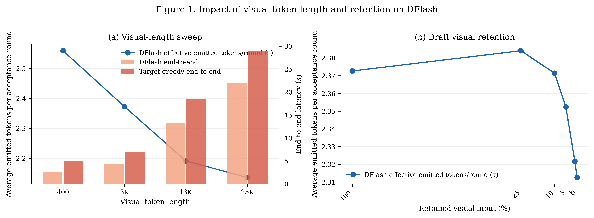
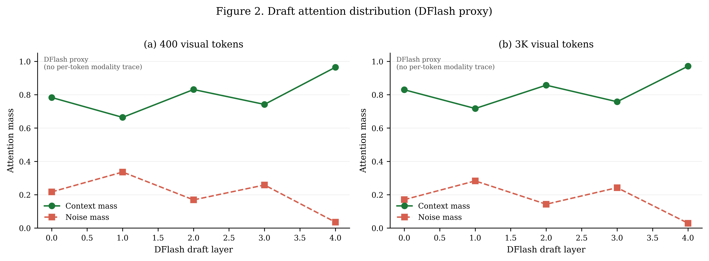
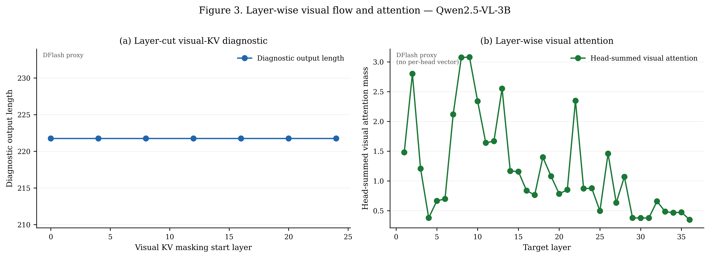
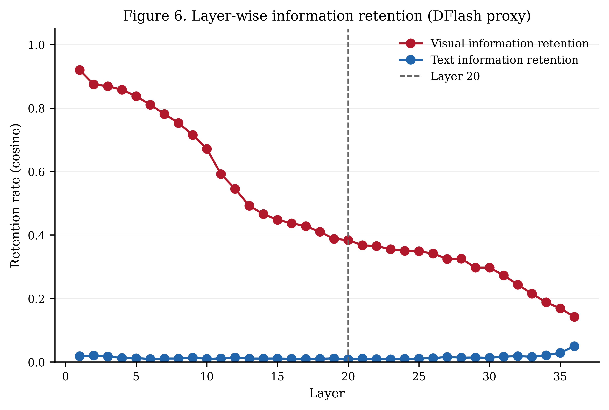

# Final DFlash Validation Report

**Overall status:** `INCOMPLETE DIAGNOSTIC`

This report aggregates existing Qwen2.5-VL-3B DFlash measurements. It is a local diagnostic report, not a claim of paper-level reproduction or method superiority.

## Scope and provenance

- Primary run: `results/sparrow_validation_dflash_qwen25vl3b_2026-08-24_flash_model_parallel_2gpu`
- Layer diagnostics: `results/sparrow_validation_dflash_qwen25vl3b_2026-08-25_layer_analysis`
- Target model(s): `Qwen/Qwen2.5-VL-3B-Instruct`
- Calibration policy/policies: `allow_out_of_tolerance`
- Source row counts: length `200`, retention `300`, context attention `40830`, layer diagnostics `3950`.
- Audited rows used for aggregates: length `199`, retention `300`, context attention `40830`, layer diagnostics `3950`.

## Executive summary

The three primary DFlash stages produced `41330` rows. The standalone layer run produced `3950` audited-valid target-side diagnostic rows, including `7` aggregate layer-cut groups at cuts `0, 4, 8, 12, 16, 20, 24`.
The primary audit records `413` decode mismatches, `1` unsupported rows, and `0` runtime error rows. The overall report status is `INCOMPLETE DIAGNOSTIC`.

## CONFIRMED

- The requested primary stage artifacts exist and were read successfully.
- The layer-cut artifact contains `3950` audited-valid target-side diagnostic rows; its visual-KV subset covers cuts `0, 4, 8, 12, 16, 20, 24`.
- The primary audit reports `0` contract-invalid rows; the layer audit reports `0` contract-invalid rows.
- Retention fingerprint integrity is preserved in the primary audit where checked.

## EXPLORATORY

The following are measured trends, not claims that DFlash satisfies the locked success criterion:

- Length and retention summaries report effective acceptance, end-to-end speedup, and exact output-match rate by condition.
- Context-attention summaries report draft-layer context/noise mass at the available `400, 3000` visual-token targets.
- Layer summaries report target-side visual-KV masking output length, visual attention mass, and visual/text hidden-state cosine curves.

## Figure-format note

The four composites follow the Sparrow/MSD Figure 1/2/3/6 numbering, panel structure, serif typography, and paper palette. Figure 2 is a DFlash proxy because the source lacks per-token modality traces; Figure 3(b) is a DFlash proxy using head-summed visual attention because no per-head vector is archived.

## Diễn giải theo từng thực nghiệm

Phần này đọc các hình theo câu hỏi mà DFlash thực sự đo. Các insight bên dưới là xu hướng quan sát được trên artifact hiện tại; chúng không vượt qua các giới hạn losslessness và calibration đã nêu ở cuối báo cáo.

## Experiment 1 — Visual-length sweep

### Mục tiêu

Đo ảnh hưởng của độ dài visual context lên chi phí end-to-end và khả năng tạo proposal của DFlash. Đây là phép đo trực tiếp nhất cho trade-off giữa lượng thông tin video mà draft phải xử lý và số token draft có thể phát ra trong một acceptance round.

### Cách thực hiện

Thực nghiệm dùng cohort VDC-50 gồm 50 video. Mỗi video được chạy ở bốn mốc visual nominal `400, 3000, 13000, 25000`, tạo thành 200 length jobs trước audit.
Với mỗi job, calibration map mốc nominal sang cấu hình decode video (số frame và pixel budget). Prompt được chuẩn bị một lần bằng Qwen2.5-VL processor, vị trí video token và input fingerprint được ghi lại. Vì source run dùng `allow_out_of_tolerance`, actual visual-token count có thể lệch mốc nominal.
Target greedy được chạy làm reference trên prompt đầy đủ. Sau đó `InstrumentedDFlashDecoder` chạy DFlash trên cùng prompt với greedy decoding và `max_new_tokens=256`. Hai chuỗi output được so sánh exact token-by-token; mỗi acceptance round lưu proposal count, matched proposal và effective emitted tokens.
Báo cáo aggregate `tau_proposal`, `tau_effective`, target/DFlash end-to-end latency và `speedup = target_end_to_end / dflash_end_to_end`. Các row unsupported, error hoặc bị audit loại khỏi mean nhưng vẫn được giữ trong status counts.

*Hình 1. Panel (a) là visual-length sweep; panel (b) là retention sweep. Đường τ và các cột latency dùng metric DFlash-native.*

### Kết quả và nhận xét

Khi nominal visual context tăng từ `400` đến `25000`, DFlash có `tau_effective` trong khoảng `2.135`–`2.559` và speedup trong khoảng `1.318`–`1.897`. Latency tăng theo độ dài context; đây là xu hướng chi phí phù hợp với việc target và draft phải xử lý nhiều visual hidden states hơn.

**Insight thực nghiệm.** Trong artifact này, visual context dài hơn làm end-to-end cost tăng và τ giảm nhẹ: DFlash phát được ít token hiệu dụng hơn mỗi round khi context dài. Tuy nhiên, speedup vẫn lớn hơn 1 ở cả bốn mốc trong aggregate hiện tại, nghĩa là speculative path vẫn nhanh hơn target greedy về mặt thời gian đo được trên cohort này.

**Cảnh báo diễn giải.** Exact output match chỉ đạt khoảng 10–18% tùy mốc và có một unsupported row ở mốc 25K. Vì vậy xu hướng latency/τ nên được xem là exploratory; chưa thể dùng nó để tuyên bố DFlash lossless hoặc kết luận chắc chắn về chất lượng output.

## Experiment 2 — Draft visual retention

### Mục tiêu

Kiểm tra mức độ DFlash phụ thuộc vào visual conditioning ở draft. Target vẫn giữ prompt đầy đủ; chỉ hidden context truyền cho draft bị mask theo các tỷ lệ `100, 25, 10, 5, 1, 0%`. Fingerprint của target được giữ lại để kiểm tra rằng intervention không thay đổi input của target.

### Cách thực hiện

Thực nghiệm dùng cùng 50 video và sáu retention levels `100, 25, 10, 5, 1, 0%`, tạo thành 300 retention jobs. Prompt full được calibrate ở nominal khoảng `3K`; context length, visual positions và full-target fingerprint được lưu trước khi mask.
DFlash tạo `hidden_context_mask`: text positions luôn được giữ, còn các visual positions sau phần được giữ lại bị đánh dấu để zero. Ở retention decode, target vẫn greedy-prefill và verify trên full hidden context; chỉ tensor conditioning truyền vào draft được biến đổi bởi mask. Vì source policy là `allow_out_of_tolerance`, actual visual-token count giữa các sample không hoàn toàn đồng nhất.
Với mỗi phần trăm, `apply_hidden_context_mask` tạo bản copy hidden context đã zero các visual rows bị loại. DFlash sau đó chạy cùng decoder và cùng `max_new_tokens=256` như length sweep. Target fingerprint được đối chiếu lại để bảo đảm intervention chỉ tác động vào draft-side conditioning.
Mỗi row lưu retention percentage, mask, target/speculative output IDs, acceptance rounds, `tau_effective`, latency và speedup. Retention không dùng attention selection; đây là phép đo độ nhạy của DFlash với hidden visual conditioning theo một mask deterministic.

*Panel (b) của Hình 1: retention sweep theo phần trăm hidden visual context được giữ lại trong draft.*

### Kết quả và nhận xét
Trong retention sweep, `tau_effective` chỉ dao động khoảng `2.313`–`2.384`, còn speedup khoảng `1.584`–`1.612`. Các đường cong khá phẳng; mức retention thấp không tạo ra cải thiện đơn điệu rõ ràng so với 100%.

**Insight thực nghiệm.** Với DFlash checkpoint hiện tại, việc giảm hidden visual context của draft từ 100% xuống 0% chưa cho thấy quy luật ‘càng bỏ visual càng tốt’. τ đạt gần cực đại ở vùng retention trung gian, trong khi speedup cũng chỉ thay đổi nhẹ. Điều này gợi ý draft conditioning có thể đã được DFlash nén/điều hòa đủ để việc zero thêm visual rows không chuyển thành lợi ích acceptance lớn; đây là giả thuyết cần kiểm tra lại sau khi losslessness được làm sạch.

**Nhận xét phương pháp.** Kết quả này đã trả lời được câu hỏi DFlash-native ‘draft chịu được bao nhiêu visual hidden context’, nhưng không nên diễn giải thành kết luận về attention-guided visual selection của MSD. Mismatch rate cao gần như giống nhau ở mọi retention group cũng cho thấy cần tách lỗi nền của decoder khỏi hiệu ứng retention.

## Experiment 3 — DFlash draft attention distribution

### Mục tiêu

Quan sát DFlash draft phân bổ attention giữa target-hidden context và noise keys trong các draft layer, tại hai visual-context target nominal `400` và `3000`.

### Cách thực hiện

Attention probe được chạy trên 50 video tại hai target visual nominal `400` và `3000`. DFlash attention implementation tạm thời được chuyển sang `eager mode` để forward hook có thể nhận raw attention tensor, sau đó configuration được khôi phục.
Hook được gắn vào các self-attention layer của DFlash draft trong lúc instrumented decode. Với attention tensor có dạng batch/head/query/key, `context_length` xác định boundary giữa target-hidden context và draft noise keys.
Mỗi captured record được rút gọn bằng cách cộng key positions `[:context_length]` thành `context_attention_mass`, cộng phần còn lại thành `noise_attention_mass`, rồi mean trên các head/query được capture. Các row được group theo target visual nominal và draft layer; tổng hai mass dùng để kiểm tra attention normalization.
Vì artifact không lưu mapping per-token sang Instruction/Visual/Text và không archive đầy đủ modality positions trong summary row, hình này là context/noise diagnostic chứ không phải modality-attention plot.

*Hình 2. Context/noise attention mass theo DFlash draft layer tại nominal 400 và 3K visual tokens.*

### Kết quả và nhận xét

Các mốc quan sát cho thấy ở mốc `400`, context mass dao động 0.664–0.965 và đạt 0.965 ở draft layer cuối; ở mốc `3000`, context mass dao động 0.717–0.971 và đạt 0.971 ở draft layer cuối.

**Insight thực nghiệm.** Ở draft layer cuối, khoảng 96–97% attention mass nằm trong target-hidden context ở cả hai mốc. Điều này cho thấy DFlash draft dựa chủ yếu vào conditioning đã được target tạo ra, thay vì dành phần lớn attention cho noise block hiện tại. Noise vẫn tăng ở một số layer giữa, cho thấy draft không chỉ sao chép context mà còn dùng các key noise để xây dựng proposal ngắn hạn.

**Giới hạn.** Context ở đây gộp visual, text và instruction; do đó không thể kết luận riêng visual modality nhận bao nhiêu attention. Insight hợp lệ nhất là về vai trò của target context trong DFlash drafting, không phải về token selection.

## Experiment 4 — Layer-wise visual flow and hidden-state retention

### Mục tiêu

Đánh giá visual information ở target side qua ba probe: mask visual KV từ các layer khác nhau, đo visual attention theo target layer, và đo cosine giữa hidden state với input embedding ban đầu.

### Cách thực hiện

Layer run là target-side diagnostic độc lập trên 50 video tại nominal visual target `3000`. Nó không chạy speculative acceptance; mục tiêu là tách ảnh hưởng của target layer khỏi telemetry của DFlash decoder.
Trước mỗi probe, Qwen2.5-VL prefill được chuẩn bị và visual/instruction/text positions được xác định. Với visual-KV experiment, attention mask của target self-attention được bọc từ cut `0, 4, 8, 12, 16, 20, 24` trở đi; target sau đó greedy-generate với `max_new_tokens=256`. Chỉ `diagnostic_output_length` được ghi lại, không phải task accuracy.
Với attention experiment, hook capture query instruction cuối trong target forward. Visual key positions được cộng qua toàn bộ head để tạo một scalar `visual_attention_mass` cho mỗi target layer; do đó kết quả không còn chiều per-head.
Với cosine experiment, forward hook được đặt ở từng decoder block. Hidden state tại visual và text positions được so cosine với input embedding tương ứng, rồi average theo positions và 50 sample qua 36 decoder layers. Đây là phép đo hình học của representation, không phải phép đo losslessness.

*Hình 3. Panel (a) là output-length diagnostic dưới visual-KV masking; panel (b) là head-summed visual attention theo target layer.*

### Kết quả panel (a): visual-KV cut

Mean diagnostic output length giữ nguyên ở mức `221.760` qua `7` cut points. Đường phẳng này chỉ cho biết độ dài output không đổi trong probe hiện tại; nó không chứng minh task accuracy hoặc answer quality không đổi.

**Insight thực nghiệm.** Với metric output length, chưa quan sát thấy layer cut làm thay đổi độ dài câu trả lời. Probe này không đủ để kết luận causal importance của visual KV; cần thêm token agreement, answer score hoặc task accuracy nếu muốn đánh giá chất lượng.

### Kết quả panel (b): visual attention theo layer

Head-summed visual attention đạt cực đại khoảng `3.080` ở target layer `9` và giảm còn `0.348` ở layer cuối. Vì đây là tổng qua head, giá trị có thể lớn hơn 1 và không phải là xác suất của một head đơn lẻ.

**Insight thực nghiệm.** Visual attention tập trung mạnh hơn ở các layer giữa, sau đó giảm ở các layer cuối. Điều này gợi ý visual information được khai thác mạnh trong middle processing rồi được biến đổi thành representation phục vụ các layer sâu hơn; đây là insight cơ chế, chưa phải bằng chứng rằng các layer giữa có causal contribution cao hơn.

### Kết quả Figure 6: hidden-state cosine

Visual cosine giảm từ `0.920` ở layer `1` xuống `0.142` ở layer `36`. Text cosine duy trì ở mức thấp trong toàn bộ curve.

**Insight thực nghiệm.** Hidden representation thay đổi đáng kể so với input embedding ban đầu khi đi qua các layer. Visual cosine giảm không đồng nghĩa visual information bị mất; nó chỉ cho thấy representation không còn giữ hình học ban đầu. Vì vậy Figure 6 nên được dùng để mô tả transformation/retention hình học, không thay thế accuracy hay losslessness.

*Hình 6. Visual/text cosine retention theo target layer; đường cong là diagnostic representation, không phải task accuracy.*

## FAILED / INCOMPLETE

- Primary coverage is `False`; missing milestones: `{"layer_cuts": [0, 4, 8, 12, 16, 20, 24]}`.
- Layer coverage is `False` because this standalone layer directory does not contain the other primary-stage milestones: `{"attention_targets": [400, 3000], "length_targets": [400, 3000, 13000, 25000], "retention_percentages": [0, 1, 5, 10, 25, 100]}`.
- Decode losslessness is incomplete: `413` mismatch rows and `1` unsupported rows remain.
- Calibration policy/policies recorded in the source are `allow_out_of_tolerance`; strict in-tolerance calibration evidence is therefore not established.

## HIGHEST VERIFIED RUNG

R6 was operationally attempted: the full planned local condition matrix was executed and archived. It is not a green full-study result because the losslessness and coverage gates failed. R7 decision-level evidence was not reached.

## EVIDENCE GAPS

- Root cause of the systematic target/speculative output mismatch is not isolated.
- Strict in-tolerance calibration coverage and a single merged audit are not available.
- No baseline comparison under a locked primary metric is included in this DFlash bundle.
- Runtime warnings from video decoding and processor argument handling were recorded but not experimentally ruled out as contributors.

## RECOMMENDED NEXT

First isolate the losslessness mismatch with a one-video, one-target, strict-calibration reproduction and token-level first-divergence trace; only after that passes should the full matrix be rerun and merged with layer diagnostics under one strict audit.

## Figures and tables

- [figure1_insight_summary.png](figure1_insight_summary.png)
- [figure1_insight_summary.pdf](figure1_insight_summary.pdf)
- [figure1_insight_summary.svg](figure1_insight_summary.svg)
- [figure2_insight_attention.png](figure2_insight_attention.png)
- [figure2_insight_attention.pdf](figure2_insight_attention.pdf)
- [figure2_insight_attention.svg](figure2_insight_attention.svg)
- [figure3_insight_layer_analysis.png](figure3_insight_layer_analysis.png)
- [figure3_insight_layer_analysis.pdf](figure3_insight_layer_analysis.pdf)
- [figure3_insight_layer_analysis.svg](figure3_insight_layer_analysis.svg)
- [figure6_insight_retention.png](figure6_insight_retention.png)
- [figure6_insight_retention.pdf](figure6_insight_retention.pdf)
- [figure6_insight_retention.svg](figure6_insight_retention.svg)
- [summary.json](summary.json)
- [source_audits.json](source_audits.json)
- [length_summary.csv](length_summary.csv)
- [retention_summary.csv](retention_summary.csv)
- [attention_summary.csv](attention_summary.csv)
- [layer_visual_kv_summary.csv](layer_visual_kv_summary.csv)
- [layer_attention_summary.csv](layer_attention_summary.csv)
- [layer_cosine_summary.csv](layer_cosine_summary.csv)

## Length summary

| Target | N | Valid | OK | Mismatch | Unsupported | Error | Unknown | Lossless rate | τ | Speedup |
|---:|---:|---:|---:|---:|---:|---:|---:|---:|---:|---:|
| 400 | 50 | 50 | 9 | 41 | 0 | 0 | 0 | 0.180 | 2.559 | 1.897 |
| 3000 | 50 | 50 | 9 | 41 | 0 | 0 | 0 | 0.180 | 2.373 | 1.613 |
| 13000 | 50 | 50 | 5 | 45 | 0 | 0 | 0 | 0.100 | 2.191 | 1.408 |
| 25000 | 50 | 49 | 9 | 40 | 1 | 0 | 0 | 0.184 | 2.135 | 1.318 |

## Retention summary

| Retention | N | Valid | OK | Mismatch | Unsupported | Error | Unknown | Lossless rate | τ | Speedup |
|---:|---:|---:|---:|---:|---:|---:|---:|---:|---:|---:|
| 0 | 50 | 50 | 9 | 41 | 0 | 0 | 0 | 0.180 | 2.313 | 1.584 |
| 1 | 50 | 50 | 9 | 41 | 0 | 0 | 0 | 0.180 | 2.322 | 1.588 |
| 5 | 50 | 50 | 9 | 41 | 0 | 0 | 0 | 0.180 | 2.352 | 1.603 |
| 10 | 50 | 50 | 9 | 41 | 0 | 0 | 0 | 0.180 | 2.371 | 1.610 |
| 25 | 50 | 50 | 9 | 41 | 0 | 0 | 0 | 0.180 | 2.384 | 1.612 |
| 100 | 50 | 50 | 9 | 41 | 0 | 0 | 0 | 0.180 | 2.373 | 1.602 |
