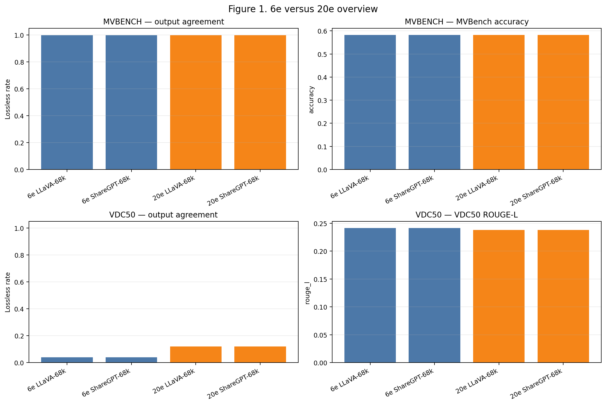
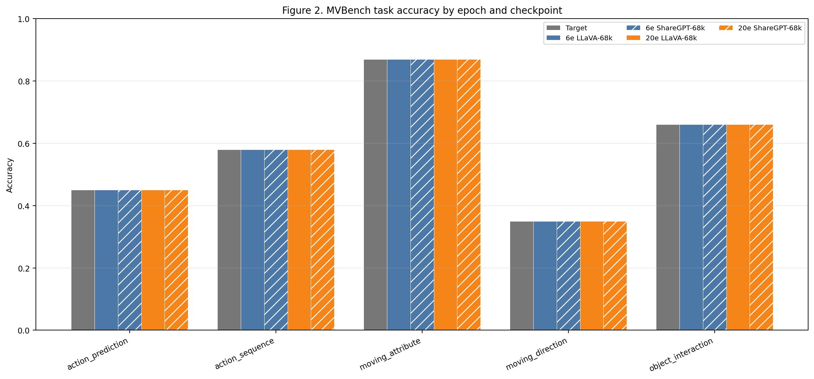
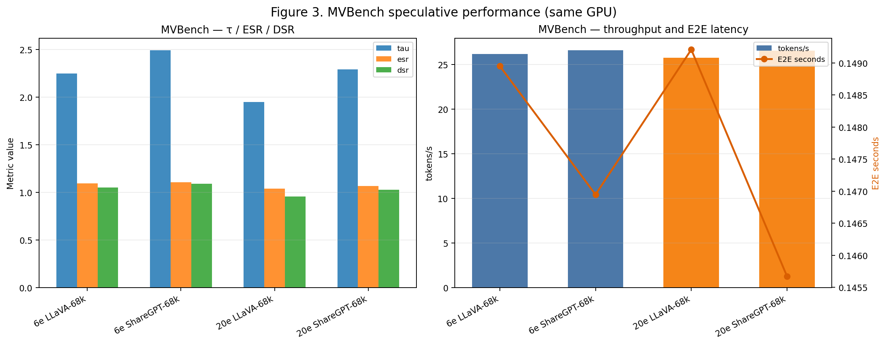
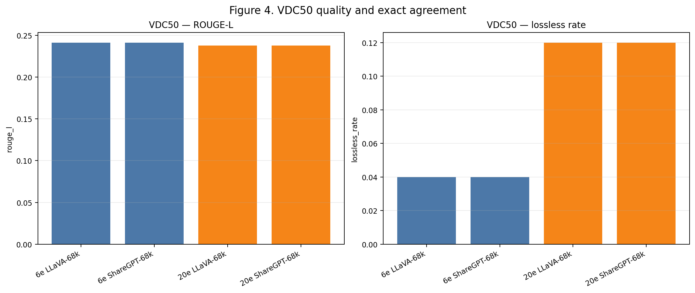
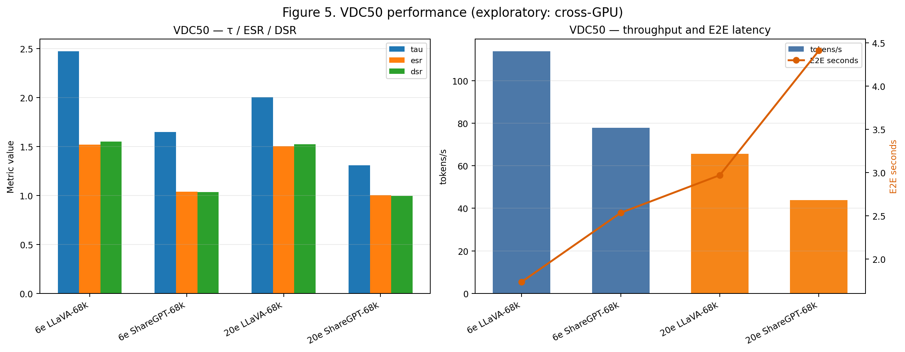
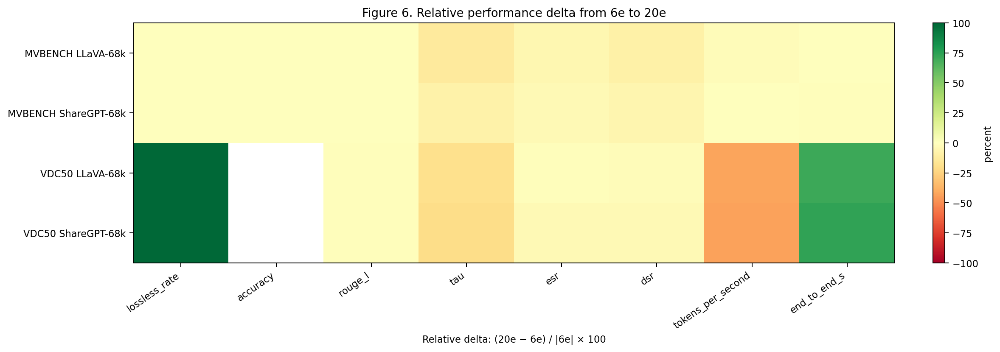

# Báo cáo performance DFlash Qwen2.5-VL-3B: 6 epoch so với 20 epoch

**Trạng thái:** `COMPLETED — paired artifact comparison`

Báo cáo được sinh từ các JSON artifact đã hoàn tất; không chạy lại model/GPU và không sửa artifact nguồn.

## Executive summary

- MVBench gồm 500 mẫu ghép cặp, cùng GPU giữa 6e và 20e; VDC50 gồm 50 mẫu ghép cặp nhưng chạy khác GPU.
- MVBench giữ nguyên accuracy và output: lossless 99.8% → 99.8%; paired target/checkpoint hash changes đều bằng 0.
- VDC50 lossless tăng từ 4.0% lên 12.0% cho cả hai checkpoint; đây là kết quả mô tả, không phải bằng chứng sạch về tác động của epoch vì target hash đổi 48/50 mẫu giữa hai GPU.
- Trên MVBench, 20e không tạo speedup cao hơn 6e: ESR LLaVA 1.093 → 1.041; ShareGPT 1.107 → 1.066.
- Mọi kết luận latency/throughput VDC50 được đánh dấu `exploratory` do 6e chạy `cuda:0` còn 20e chạy `cuda:1`.

*Hình 1. Overview về exact agreement và metric chất lượng chính của hai epoch.*

## 1. Artifact identity và protocol

| Epoch | MVBench Full | VDC50 Full | Checkpoint families |
|---|---|---|---|
| 6e | `results/infer/mvbench100_full_20260823` | `results/infer/vdc50_exp_full_dflash_20260823` | LLaVA-68k, ShareGPT-68k |
| 20e | `results/infer/dflash20e_20260825/mvbench100_full_20260823` | `results/infer/dflash20e_20260825/vdc50_exp_full_dflash_20260823` | LLaVA-68k, ShareGPT-68k |

MVBench dùng cùng manifest 500 mẫu. VDC50 dùng hai tên manifest khác nhau, nhưng kiểm tra paired records cho thấy cùng 50 video ID, câu hỏi, câu trả lời và local video path.

### Coverage

- MVBench: 500 paired samples; 6e/20e đều hoàn tất, không có runtime error.
- VDC50: 50 paired samples; 6e/20e đều hoàn tất, không có runtime error.
- Device MVBench: 6e `cuda:0`, 20e `cuda:0`; comparable = `True`.
- Device VDC50: 6e `cuda:0`, 20e `cuda:1`; comparable = `False`.

## 2. MVBench

*Hình 2. Accuracy theo task, đối chiếu target với hai checkpoint ở 6e và 20e.*

### Performance table

| Epoch | Checkpoint | Lossless | Accuracy | ROUGE-L | BLEU | τ | ESR | DSR | tok/s | E2E (s) | Device |
|---|---|---:|---:|---:|---:|---:|---:|---:|---:|---:|---|
| 6e | LLaVA-68k | 99.8% | 58.2% | 0.225 | 0.592 | 2.248 | 1.093 | 1.052 | 26.21 | 0.149 | cuda:0 |
| 20e | LLaVA-68k | 99.8% | 58.2% | 0.225 | 0.592 | 1.951 | 1.041 | 0.958 | 25.79 | 0.149 | cuda:0 |
| 6e | ShareGPT-68k | 99.8% | 58.2% | 0.225 | 0.592 | 2.495 | 1.107 | 1.093 | 26.63 | 0.147 | cuda:0 |
| 20e | ShareGPT-68k | 99.8% | 58.2% | 0.225 | 0.592 | 2.292 | 1.066 | 1.026 | 26.56 | 0.146 | cuda:0 |

*Hình 3. τ, ESR, DSR, throughput và E2E latency trên MVBench; 6e và 20e chạy cùng GPU nên có thể so sánh trực tiếp hơn VDC50.*

### Phân tích MVBench

- Accuracy của target và hai checkpoint giữ ở mức 58.2%; exact agreement của cả hai checkpoint giữ ở 99.8% ở cả hai epoch.
- Hash comparison không phát hiện thay đổi output giữa 6e và 20e trên 500 mẫu cho target, LLaVA-68k và ShareGPT-68k. Đây là bằng chứng mạnh rằng trong workload MVBench này, 20e không đổi hành vi output quan sát được.
- τ giảm ở 20e: LLaVA 2.248 → 1.951; ShareGPT 2.495 → 2.292.
- ESR giảm tương ứng: LLaVA 1.093 → 1.041; ShareGPT 1.107 → 1.066. Vì vậy 20e không cho thấy lợi ích tốc độ rõ ràng trên MVBench dù chất lượng không đổi.

## 3. VDC50

*Hình 4. ROUGE-L và lossless rate trên VDC50; lossless là exact token equality với target của từng run.*

### Performance table

| Epoch | Checkpoint | Lossless | Accuracy | ROUGE-L | BLEU | τ | ESR | DSR | tok/s | E2E (s) | Device |
|---|---|---:|---:|---:|---:|---:|---:|---:|---:|---:|---|
| 6e | LLaVA-68k | 4.0% | — | 0.241 | 0.050 | 2.474 | 1.521 | 1.552 | 113.83 | 1.737 | cuda:0 |
| 20e | LLaVA-68k | 12.0% | — | 0.238 | 0.047 | 2.004 | 1.504 | 1.523 | 65.56 | 2.970 | cuda:1 |
| 6e | ShareGPT-68k | 4.0% | — | 0.241 | 0.050 | 1.650 | 1.041 | 1.036 | 77.75 | 2.536 | cuda:0 |
| 20e | ShareGPT-68k | 12.0% | — | 0.238 | 0.047 | 1.309 | 1.003 | 0.997 | 43.80 | 4.409 | cuda:1 |

*Hình 5. Performance VDC50; các metric thời gian/throughput là exploratory vì khác GPU giữa 6e và 20e.*

### Phân tích VDC50

- Lossless tăng từ 4.0% lên 12.0% cho LLaVA-68k và cùng mức tăng cho ShareGPT-68k.
- ROUGE-L LLaVA giảm 0.241 → 0.238; BLEU giảm 0.050 → 0.047. Tuy nhiên target hash đổi 48/50 mẫu giữa hai GPU, nên không thể quy phần chênh lệch này hoàn toàn cho epoch.
- LLaVA 20e ghi nhận ESR 1.504 và ShareGPT 20e 1.003; các con số thấp hơn 6e trong artifact hiện tại nhưng bị confound bởi GPU/runtime khác nhau.

## 4. Delta 20e − 6e

*Hình 6. Delta tương đối `(20e − 6e) / |6e|`; ô trống là metric không phù hợp hoặc thiếu dữ liệu.*

Heatmap chỉ nhằm tổng hợp hướng thay đổi. Với VDC50, các ô performance không được dùng để kết luận causal về số epoch; chúng phải được đọc cùng giới hạn cross-GPU.

### Bảng delta định lượng

#### MVBench — cùng GPU, so sánh trực tiếp hơn

| Metric | LLaVA Δ | LLaVA relative | ShareGPT Δ | ShareGPT relative |
|---|---:|---:|---:|---:|
| Lossless rate | 0.000 | 0.0% | 0.000 | 0.0% |
| Accuracy | 0.000 | 0.0% | 0.000 | 0.0% |
| ROUGE-L | 0.000 | 0.0% | 0.000 | 0.0% |
| BLEU | 0.000 | 0.0% | 0.000 | 0.0% |
| τ | -0.297 | -13.2% | -0.203 | -8.1% |
| ESR | -0.053 | -4.8% | -0.041 | -3.7% |
| DSR | -0.094 | -8.9% | -0.066 | -6.1% |
| tokens/s | -0.423 | -1.6% | -0.075 | -0.3% |
| E2E (s) | 0.000 | 0.2% | -0.001 | -0.9% |

#### VDC50 — mô tả, bị confound bởi khác GPU

| Metric | LLaVA Δ | LLaVA relative | ShareGPT Δ | ShareGPT relative |
|---|---:|---:|---:|---:|
| Lossless rate | 0.080 | 200.0% | 0.080 | 200.0% |
| Accuracy | — | — | — | — |
| ROUGE-L | -0.003 | -1.4% | -0.003 | -1.4% |
| BLEU | -0.003 | -6.9% | -0.003 | -6.9% |
| τ | -0.470 | -19.0% | -0.341 | -20.6% |
| ESR | -0.016 | -1.1% | -0.038 | -3.6% |
| DSR | -0.029 | -1.8% | -0.039 | -3.8% |
| tokens/s | -48.269 | -42.4% | -33.950 | -43.7% |
| E2E (s) | 1.233 | 71.0% | 1.873 | 73.9% |

## 5. Paired output stability

| Dataset | So sánh | Changed | Unchanged | Changed rate |
|---|---|---:|---:|---:|
| MVBench | Target | 0 | 500 | 0.0% |
| MVBench | LLaVA-68k | 0 | 500 | 0.0% |
| MVBench | ShareGPT-68k | 0 | 500 | 0.0% |
| VDC50 | Target | 48 | 2 | 96.0% |
| VDC50 | LLaVA-68k | 47 | 3 | 94.0% |
| VDC50 | ShareGPT-68k | 47 | 3 | 94.0% |

## 6. Confirmed findings

1. Cả hai epoch đều có coverage đầy đủ: 500 MVBench và 50 VDC50, không có runtime error.
2. Trên MVBench, 20e giữ nguyên accuracy, lossless rate và output hashes so với 6e trên toàn bộ 500 mẫu.
3. Trên MVBench, các metric acceptance/speed của 20e không cao hơn 6e trong artifact Full hiện tại.
4. Trên VDC50, lossless rate quan sát được tăng từ 4% lên 12% cho cả hai checkpoint.

## 7. Exploratory findings và giới hạn

1. VDC50 6e chạy trên `cuda:0`, còn VDC50 20e chạy trên `cuda:1`; mọi so sánh E2E latency, throughput, ESR và DSR giữa hai epoch là exploratory.
2. Target output hash của VDC50 đổi trên 48/50 mẫu giữa hai run. Vì target là baseline khác nhau ở cấp runtime, chênh lệch ROUGE-L/BLEU/lossless không thể được diễn giải như pure epoch effect.
3. Lossless là exact token equality, không phải đánh giá ngữ nghĩa; ROUGE-L/BLEU của VDC50 là metric mô tả và không thay thế human/semantic evaluation.
4. Checkpoint identity được xác định từ tên thư mục 6e/20e và checkpoint labels trong sample artifacts; report không giải nén lại tensor checkpoint.

## 8. Recommended next experiment

Để kết luận causal về 6e so với 20e trên VDC50, cần rerun hai checkpoint trên cùng một GPU, cùng process/runtime, cùng manifest và cùng seed/runtime settings; sau đó giữ nguyên paired hash analysis trong report này.

## 9. Artifacts

- `epoch_comparison.csv`: metric theo dataset/epoch/checkpoint.
- `performance.csv`: τ/ESR/DSR/throughput/latency.
- `task_accuracy.csv`: accuracy theo task.
- `paired_changes.csv`: target/checkpoint hash changes.
- `summary.json`: machine-readable aggregate and provenance.
