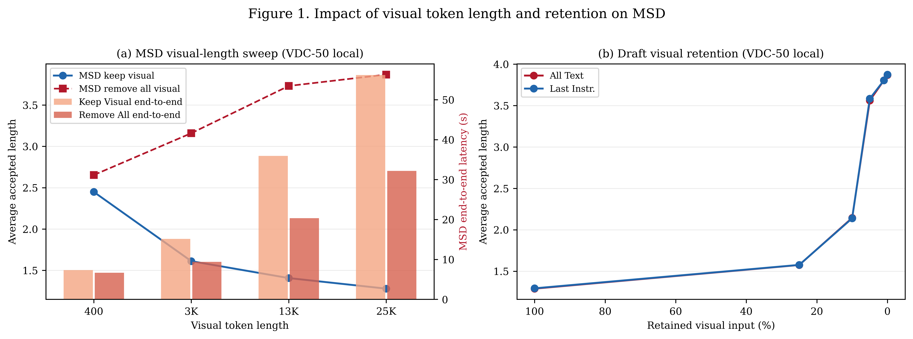
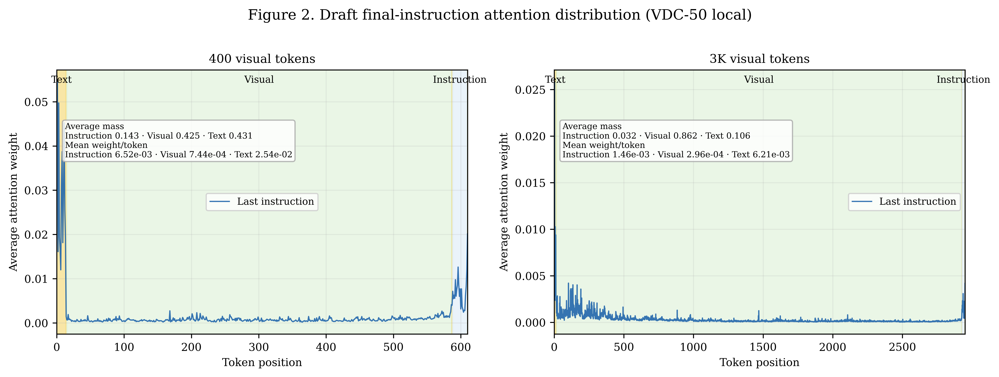
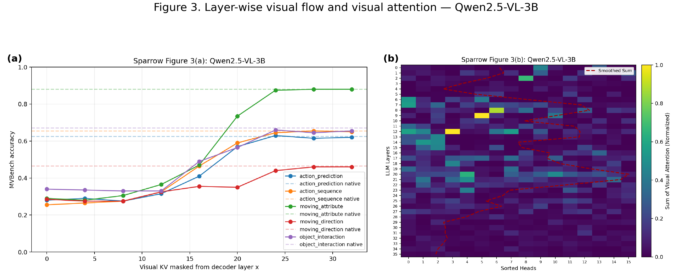
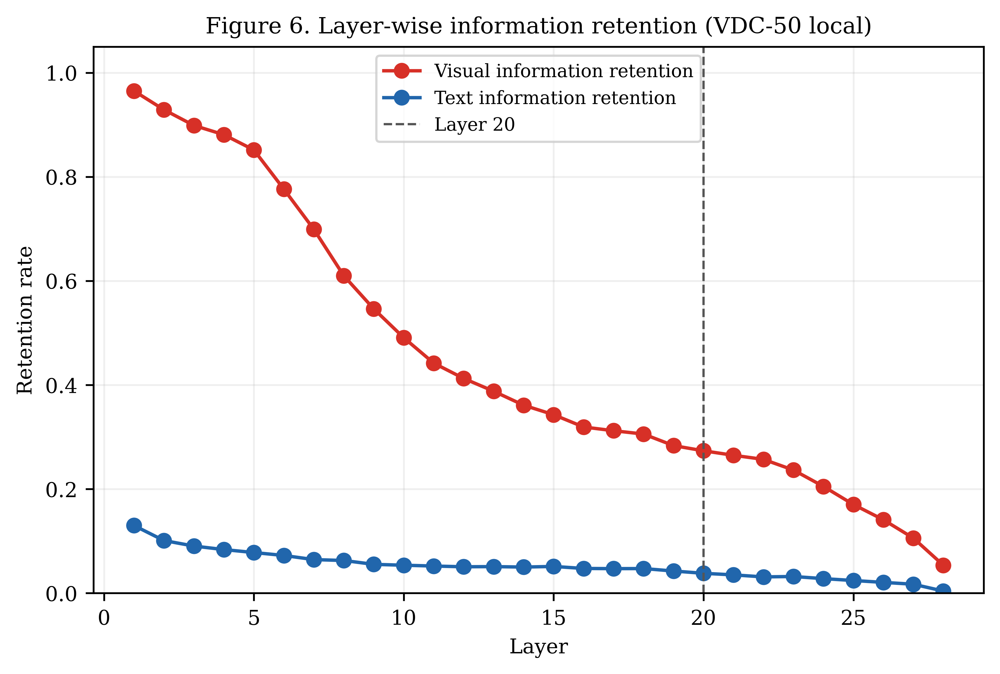

# Báo cáo thực nghiệm Sparrow insight cho MSD

Đây là thư mục canonical chứa toàn bộ hình và report được sử dụng để chỉnh sửa/phát hành. Figure 2 trong thư mục này là bản homogeneous cohort mới nhất.

## 1. Tóm tắt

Báo cáo này trình bày bộ thực nghiệm local analogue cho các insight figures của Sparrow áp dụng cho MSD trên VDC-50.

Kết luận về tính đầy đủ của bộ dữ liệu:

| Hạng mục | Kết quả |
|---|---:|
| Audit tổng thể | `valid=true` |
| Coverage | `valid=true` |
| Paired cohort dùng cho figures | 10 mẫu |
| Calibration cohort hợp lệ | 30 mẫu |
| Evidence rows | 2.659 |
| Diagnostic rows bị loại khỏi evidence | 51 |
| Test suite | 48 passed, 1 skipped |

Các Figure 1, 2 và 6 vẫn là kết quả Qwen2-VL local analogue trên VDC-50. Figure 3
đã được cập nhật riêng bằng Qwen2.5-VL-3B trên toàn bộ cohort MVBench 1.000
mẫu; cả hai panel dùng cùng model và preprocessing 8-frame. Đây không phải số
liệu exact của paper Sparrow, và attention/flow metrics không được gọi là task
accuracy của paper.

## 2. Cấu hình thực nghiệm

- Target/layer model của các figures legacy: `Qwen/Qwen2-VL-7B-Instruct`.
- Target model của Figure 3 mới: `Qwen/Qwen2.5-VL-3B-Instruct` (36 decoder layers).
- Draft: checkpoint MSD `lucylyn/MSD-Qwen2VL-7B-Instruct`.
- Dataset: VDC-50 paired cohort, chỉ dùng calibration rows có `status=ok`.
- Visual-token milestones: `400, 3000, 13000, 25000`.
- Figure 1(b) retention: `100%, 25%, 10%, 5%, 1%, 0%`.
- Selection policies: `last_instruction` và `all_text`.
- Layer experiments legacy (Figures 3/6 archive): cuts `0, 4, 8, 12, 16, 20, 24`; layerwise curves đủ 28 layers.
- Figure 3 current: Qwen2.5-VL-3B cuts `0, 4, 8, 12, 16, 20, 24, 28, 32` and all-layer attention `0..35`.
- Inference: model-parallel trên RTX 3090 + RTX A4000, có thể dùng 4-bit cho các probe phù hợp.

## 3. Coverage theo hình

| Hình | Nội dung | Evidence coverage |
|---|---|---:|
| Figure 1(a) | MSD keep-visual và remove-all tại 4 mốc | 24–28 mẫu mỗi group |
| Figure 1(b) | 2 policies × 6 retention rates tại 25K | 21–23 mẫu mỗi group |
| Figure 2 | MSD draft attention tại 0.4K và 3K | 30 mẫu mỗi group |
| Figure 3(a) | 9 visual-KV cuts + native baseline | 1.000 mẫu, 10.000 scored rows |
| Figure 3(b) | Visual attention trên toàn bộ 36 layers | 1.000 mẫu, 36.000 layer rows |
| Figure 6 / Appendix D | Cosine visual/text tại 28 layers | 30 mẫu mỗi layer |

Mọi group đều vượt ngưỡng tối thiểu 10 mẫu; không có group nào nằm trong `missing` của audit.

## 4. Kết quả, cách thực hiện và diễn giải theo từng hình

Mỗi tiểu mục dưới đây tương ứng với một hình/panel. Hình, cách chạy, thống kê và ý nghĩa được trình bày cùng nhau. Tất cả các group chỉ lấy evidence rows đã qua calibration, kiểm tra losslessness, deduplication và audit; 51 diagnostic rows không được đưa vào các trung bình cuối.

### Figure 1(a): MSD giữ hoặc bỏ visual input ở draft

Hình trên là file tổng hợp của Figure 1; panel (a) là phần so sánh `Keep Visual` và `Remove All`.

Với mỗi video và mỗi mốc `400, 3000, 13000, 25000`, hệ thống chạy hai điều kiện:

1. `msd_keep_visual`: target và draft đều nhận visual input đầy đủ ở mốc tương ứng.
2. `msd_remove_all`: target vẫn nhận toàn bộ video, còn draft nhận 0 visual token.

Draft sinh một prefix ứng viên, target kiểm tra prefix đó rồi tiếp tục sinh phần còn lại nếu cần. Mỗi row lưu số token được chấp nhận, thời gian draft/verification và đặc biệt là `end_to_end_seconds`. Hình 1(a) dùng end-to-end latency, bao gồm toàn bộ đường đi của một lần suy luận MSD; không dùng riêng draft prefill. `end_to_end_speedup` được tính tương đối với thời gian autoregressive reference: giá trị lớn hơn 1 là nhanh hơn reference, nhỏ hơn 1 là chậm hơn.

| Mốc visual | Điều kiện | N | Accepted prefix mean | End-to-end mean (s) | Speedup mean | Lossless |
|---:|---|---:|---:|---:|---:|---:|
| 400 | Keep Visual | 24 | 2,45 | 7,32 | 0,73 | 100% |
| 400 | Remove All | 26 | 2,65 | 6,66 | 0,77 | 100% |
| 3K | Keep Visual | 24 | 1,61 | 15,13 | 0,69 | 100% |
| 3K | Remove All | 27 | 3,16 | 9,38 | 1,05 | 100% |
| 13K | Keep Visual | 28 | 1,41 | 35,94 | 0,94 | 100% |
| 13K | Remove All | 25 | 3,73 | 20,34 | 1,63 | 100% |
| 25K | Keep Visual | 25 | 1,28 | 56,18 | 1,05 | 100% |
| 25K | Remove All | 26 | 3,87 | 32,18 | 1,77 | 100% |

Ý nghĩa của kết quả: khi visual context tăng, end-to-end latency của `Keep Visual` tăng từ khoảng 7,3 lên 56,2 giây. Trong cùng các mốc đó, `Remove All` rẻ hơn đáng kể ở context dài và đạt speedup trung bình khoảng 1,63–1,77 tại 13K–25K. Số token được draft chấp nhận cũng có xu hướng cao hơn khi draft không phải xử lý visual input. Đây là bằng chứng định lượng cho trade-off local giữa chi phí visual processing của draft và khả năng chấp nhận prefix. Tuy nhiên, đây là pattern đo được trên VDC-50 với checkpoint hiện tại, không phải kết luận exact cho paper Sparrow.

Links: [PNG tổng hợp](figure1/figure1_insight_summary.png) · [PDF](figure1/figure1_insight_summary.pdf) · [SVG](figure1/figure1_insight_summary.svg) · [Statistics CSV](figure1/figure1a_statistics.csv)

### Figure 1(b): compact visual input của draft theo retention

Panel (b) nằm trong [hình tổng hợp Figure 1](figure1/figure1_insight_summary.png).

Ở retention experiment, target luôn giữ full visual input tại anchor 25K. Chỉ visual input của draft được giảm theo các tỷ lệ `100%, 25%, 10%, 5%, 1%, 0%`. Hai policy chọn token khác nhau:

- `last_instruction`: dùng attention của query ở instruction cuối làm điểm chọn;
- `all_text`: dùng toàn bộ vùng text làm nguồn điểm chọn.

Các retention rows được đối chiếu target fingerprint để xác nhận rằng việc compact draft không làm thay đổi input của target. Mỗi policy có `N=21` ở mỗi retention rate cho `last_instruction` và `N=23` cho `all_text`.

| Retention | All text: E2E (s) / speedup | Last instruction: E2E (s) / speedup |
|---:|---:|---:|
| 100% | 54,85 / 1,05 | 56,03 / 1,05 |
| 25% | 49,16 / 1,16 | 50,34 / 1,16 |
| 10% | 43,36 / 1,32 | 44,27 / 1,31 |
| 5% | 33,32 / 1,66 | 33,86 / 1,67 |
| 1% | 32,49 / 1,71 | 32,89 / 1,72 |
| 0% | 32,30 / 1,72 | 32,86 / 1,72 |

Ý nghĩa của kết quả: trong thí nghiệm local này, giảm visual token của draft làm end-to-end latency giảm đều và speedup tăng; từ 100% xuống 0%, speedup tăng từ khoảng 1,05 lên 1,72. Accepted prefix cũng tăng từ khoảng 1,29 lên 3,87–3,87 token. Hai policy cho đường cong rất gần nhau, vì vậy chưa có bằng chứng mạnh rằng một policy vượt trội rõ rệt trên cohort này. Kết quả chỉ chứng minh rằng target có thể giữ nguyên full context trong khi draft được compact; nó không chứng minh rằng mọi tỷ lệ retention đều tối ưu cho mọi model hoặc dataset.

Links: [PNG tổng hợp](figure1/figure1_insight_summary.png) · [PDF](figure1/figure1_insight_summary.pdf) · [SVG](figure1/figure1_insight_summary.svg) · [Statistics CSV](figure1/figure1b_statistics.csv)

### Figure 2: phân bố draft attention theo modality

Với mỗi sample, hệ thống chạy prefill đầy đủ của MSD draft ở mốc 0.4K và 3K, lấy query là token cuối của instruction (`last_instruction`), rồi tính attention query-to-key theo:

$$
 A(q,k)=\operatorname{softmax}\left(\frac{Q_qK_k^T}{\sqrt d}+\text{mask}\right).
$$

Attention được lấy theo từng layer/head, sau đó trung bình để tạo phân bố theo vị trí token. Các vị trí được chia thành ba mask không chồng lấn: `Visual`, `Instruction` và `Text`. `visual_mass`, `text_mass`, `instruction_mass` là tổng attention trên từng mask; tổng ba mass xấp xỉ 1. `visual_entropy` là entropy chuẩn hóa của attention bên trong vùng visual: gần 0 nghĩa là tập trung vào ít token, gần 1 nghĩa là phân bố tương đối đều. Hình chính dùng 0.4K và 3K; lần chạy 25K được giữ trong dữ liệu để tạo selector cho Figure 1(b), không phải panel chính của Figure 2.

Để tránh trộn ranh giới modality khi lấy trung bình theo vị trí tuyệt đối, Figure 2 chính thức dùng một homogeneous paired cohort gồm `N=14` sample. Cả 14 sample có đúng `572` visual tokens ở target 400 và đúng `2912` visual tokens ở target 3K. Vì vậy ranh giới Visual của các sample trùng nhau và panel chỉ có một vùng Visual liên tục ở mỗi mốc. Manifest của cohort nằm trong [figure2_homogeneous_cohort.json](figure2/figure2_homogeneous_cohort.json).

Theo contract strict-preceding, nếu query nằm ở vị trí `q` thì chỉ các key ở vị trí `0..q-1` được giữ lại; query `q` và toàn bộ vị trí tương lai bị loại khỏi ba mask. Các attention weight còn lại được chuẩn hóa lại trên đúng tập key đứng trước query, nên tổng ba modality bằng 1 cho từng sample trước khi lấy trung bình cohort. Vì vậy đây là attention được thu ngay trong lần prefill tại vị trí query, không phải chạy sinh toàn bộ câu trả lời rồi tính lại attention.

Chú thích màu trong hình: xanh nhạt = `Instruction`, xanh lá = `Visual token`, vàng = `Text`. Vì độ dài prompt thực tế khác nhau giữa các sample, đường trung bình được tính theo vị trí tuyệt đối nhưng nền được tô theo modality chiếm đa số tại từng vị trí trong cohort; do đó mọi điểm của đường đều nằm trong một trong ba vùng màu. Các token text rời rạc vẫn được giữ đúng vị trí, không nối thành một dải phủ lên vùng visual. Vì thứ tự token của prompt là `Text → Visual → Instruction` (và có thể có text separator ở cuối), ba nhãn có thể xuất hiện theo thứ tự đó trên trục ngang dù thứ tự chú thích màu là Instruction, Visual, Text.

| Mốc | Visual mass | Text mass | Instruction mass | Visual entropy |
|---:|---:|---:|---:|---:|
| 0.4K | 0,425 | 0,431 | 0,143 | 0,909 |
| 3K | 0,862 | 0,106 | 0,032 | 0,866 |
| 25K (auxiliary selector) | 0,995 | 0,002 | 0,003 | 0,836 |

Trong mỗi panel, hộp `Average mass` ghi trực tiếp average attention mass của ba vùng; `Mean weight/token` ghi average attention trên từng token trong vùng đó, là đại lượng cùng đơn vị với trục Y. Vì Visual có nhiều token hơn, mass có thể lớn nhưng mean weight/token vẫn nhỏ.

Ý nghĩa của kết quả: khi context visual dài hơn, tổng attention của query cuối dồn nhiều hơn vào vùng visual; ở 3K, visual mass trung bình khoảng 0,862 so với 0,425 ở 0.4K. Tuy nhiên, không nên suy ra rằng mỗi visual token nhận nhiều attention hơn. Do số visual token tăng, attention trung bình trên từng visual token giảm xấp xỉ từ \(7,44\times10^{-4}\) ở 0.4K xuống \(2,96\times10^{-4}\) ở 3K. Đây chính là hiện tượng “dilution” theo nghĩa phân bố trên nhiều token. Entropy giảm nhẹ từ 0,909 xuống 0,866, cho thấy attention vẫn khá rộng nhưng có mức tập trung/không đều cao hơn ở context dài. Figure 2 là probe cơ chế của draft, không phải metric chất lượng câu trả lời.

Links: [PNG homogeneous](figure2/figure2_insight_attention.png) · [PDF homogeneous](figure2/figure2_insight_attention.pdf) · [SVG homogeneous](figure2/figure2_insight_attention.svg) · [Statistics CSV homogeneous](figure2/figure2_statistics.csv) · [Audit homogeneous](figure2/audit_figure2_homogeneous.json)

### Figure 3: layer-wise visual flow và visual attention (Qwen2.5-VL-3B)

Hai panel hiện dùng cùng target `Qwen/Qwen2.5-VL-3B-Instruct`, cùng cohort 1.000
mẫu MVBench (200 mẫu cho mỗi task) và cùng preprocessing video 8-frame.

**Panel (a) — layer-cut visual ablation.** Visual KV được mask từ các decoder
cut `0, 4, 8, 12, 16, 20, 24, 28, 32`, đối chiếu native baseline không mask.
Mỗi điểm có `N=200` mẫu/task; run hoàn tất với 10.000/10.000 scored rows và
không có error record. Accuracy giảm mạnh khi mask từ layer sớm và phục hồi
khi cut muộn hơn, đặc biệt từ khoảng layer 24.

**Panel (b) — visual attention theo layer/head.** Query là token instruction
cuối trước assistant marker (`last_instruction`). Attention được đo trên toàn
bộ 36 decoder layers và 16 heads; mỗi row là tổng attention từ query đến tất
cả video-token positions của một head. Có 36.000/36.000 layer rows, không có
error. Số visual tokens thực tế là 1.040–1.092 (mean 1.063, median 1.064)
trong setting 8-frame. Mean visual mass cao nhất ở layer 12 (`2,904849`) và
layer 20 (`2,790370`), giảm xuống `0,213099` ở layer 35. Heatmap được normalize
bằng một global maximum chỉ ở presentation layer; raw per-head values vẫn được
giữ trong JSONL.

Cả hai panel là validation implementation-faithful trên Qwen2.5-VL-3B, không
phải reproduction số liệu tuyệt đối của Sparrow. Attention mass là proxy cơ
chế, không tự nó chứng minh causal contribution hay task accuracy.

Links: [PNG Figure 3 composite](figure3/figure3_insight_layer_analysis.png) · [PDF](figure3/figure3_insight_layer_analysis.pdf) · [SVG](figure3/figure3_insight_layer_analysis.svg) · [Panel (a)](figure3/figure3a_qwen25vl3b_full_20260821.png) · [Panel (b)](figure3/figure3b_qwen25vl3b_visual_attention_20260822.png) · [Figure 3(a) summary](figure3a_qwen25vl3b_20260821/full/figure3a_qwen25vl3b_full_20260821.summary.json) · [Figure 3(b) summary](../figure3b_qwen25vl3b_visual_attention_20260822/visual_attention.summary.json) · [Figure 3(b) raw JSONL](../figure3b_qwen25vl3b_visual_attention_20260822/visual_attention.jsonl) · [Figure 3(b) canonical statistics CSV](figure3/figure3b_statistics.csv) · [Dated statistics CSV](figure3/figure3b_qwen25vl3b_statistics_20260822.csv)

### Figure 6 / Appendix D: cosine retention của hidden state

Ở mỗi layer, hệ thống lấy hidden state tại các vị trí visual và text rồi tính cosine similarity với input embedding ban đầu tương ứng:

$$
 \operatorname{cos}(h_l,e_0)=\frac{h_l\cdot e_0}{\lVert h_l\rVert\lVert e_0\rVert}.
$$

Kết quả được trung bình trên vị trí và 30 sample ở từng layer. Visual cosine giảm từ khoảng 0,965 ở layer 1 xuống 0,054 ở layer 28; text cosine giảm từ khoảng 0,130 xuống 0,004. Điều này cho thấy representation bị biến đổi mạnh theo chiều sâu và hidden state cuối không còn là bản sao trực tiếp của input embedding. Cosine thấp không đồng nghĩa với thông tin đã mất hoặc câu trả lời kém; đây là phép đo retention hình học, không phải accuracy.

Links: [PNG](figure6/figure6_insight_retention.png) · [PDF](figure6/figure6_insight_retention.pdf) · [SVG](figure6/figure6_insight_retention.svg) · [Statistics CSV](figure6/figure6_statistics.csv)

## 5. Cách đọc các thống kê

Các file statistics chứa `N`, mean, median, spread, quartiles và khoảng 95%
cho các metric phù hợp. CSV Figure 3(b) mới ghi rõ `ci95_method` là
`normal_approximation_1.96_SE`; các CSV legacy khác giữ contract bootstrap cũ:

- [paper_statistics.json](metadata/paper_statistics.json)
- [figure1a_statistics.csv](figure1/figure1a_statistics.csv)
- [figure1b_statistics.csv](figure1/figure1b_statistics.csv)
- [figure2_statistics.csv](figure2/figure2_statistics.csv)
- [figure3a_statistics.csv](figure3/figure3a_statistics.csv)
- [figure3b_qwen25vl3b_statistics_20260822.csv](figure3/figure3b_qwen25vl3b_statistics_20260822.csv)
- [figure6_statistics.csv](figure6/figure6_statistics.csv)

Ý nghĩa từng trường:

- `N` là số evidence rows thực sự được dùng trong group sau khi loại runtime error, mismatch token, lỗi native-prefill parity và rows không lossless. Vì vậy `N` có thể khác nhau giữa các group; đây không phải luôn là toàn bộ 50 video ban đầu.
- `mean` là giá trị trung bình dùng để vẽ và so sánh xu hướng chính; `median` cho biết giá trị điển hình ít nhạy hơn với outlier.
- `std` là độ phân tán; `p25` và `p75` mô tả 50% observations ở giữa. Khoảng cách lớn giữa mean và median hoặc giữa p25/p75 cho thấy runtime/metric biến thiên mạnh giữa video.
- `ci95_low` và `ci95_high` là khoảng bất định mô tả từ cohort local; cách tính
  được ghi trong metadata/CSV (`bootstrap` cho legacy, `normal_approximation_1.96_SE`
  cho Figure 3(b) mới). Đây không phải confidence interval của paper và không
  được dùng một mình để tuyên bố ý nghĩa thống kê nhân quả.

Khi đọc các bảng, cần dùng đúng chiều của metric. Latency càng thấp càng tốt; `end_to_end_speedup` càng cao càng tốt và chỉ vượt 1 khi nhanh hơn autoregressive reference; `accepted_prefix_tokens` cao cho thấy draft tạo prefix dễ được target chấp nhận; `lossless=1` là điều kiện đúng/sai của output chứ không phải điểm chất lượng liên tục. Với Figure 2, ba modality mass nên cộng xấp xỉ 1, còn entropy cao biểu thị attention phân bố đều hơn trong vùng visual. Với Figure 3 và Figure 6, các metric là proxy cơ chế: chúng giúp mô tả attention/representation biến đổi ra sao, không thay thế task accuracy.

Do báo cáo hiện tại là local analogue và không thực hiện kiểm định giả thuyết/p-value giữa các điều kiện, các chênh lệch như `56,18 s` so với `32,18 s` nên được gọi là khác biệt quan sát được trên cohort này. Kết luận mạnh hơn cần thêm cohort độc lập, kiểm soát seed/hardware và một kiểm định thống kê được định trước.

## 6. Provenance và audit

- [audit_full.json](audit/audit_full.json): audit tổng thể, coverage, calibration và các lỗi contract.
- [audit_figure2_homogeneous.json](figure2/audit_figure2_homogeneous.json): audit riêng cho Figure 2 homogeneous cohort.
- [results.jsonl](../results.jsonl): chỉ gồm evidence rows đã qua filtering/deduplication.
- [diagnostic_rows.jsonl](../diagnostic_rows.jsonl): rows runtime/losslessness mismatch được giữ riêng để truy vết.
- [Calibration JSONL](../../sparrow_validation_qwen2vl_supplement_20260819/calibration.jsonl).
- [Cohort manifest](../../sparrow_validation_qwen2vl_supplement_20260819/cohort_manifest.jsonl).

Các diagnostic rows không được dùng để tăng coverage hoặc tính statistics cuối. Report chính không chứa watermark `INCOMPLETE DIAGNOSTIC`.

## 7. Giới hạn diễn giải

1. Kết quả là local Qwen2-VL analogue trên VDC-50, không thay thế số liệu exact của paper Sparrow.
2. Calibration có paired cohort 30 mẫu, nhưng evidence intersection sau losslessness filtering là 10 mẫu; đây là mức tối thiểu của local contract.
3. Hình và metric được thiết kế để kiểm tra insight của Sparrow cho MSD; không mở rộng sang các bảng benchmark hoặc Figures ngoài contract hiện tại.

## 8. File dữ liệu chính

- [Report gốc tiếng Anh](REPORT.md)
- [Audit full](audit/audit_full.json)
- [Audit Figure 2 homogeneous](figure2/audit_figure2_homogeneous.json)
- [Evidence results](../results.jsonl)
- [Diagnostic rows](../diagnostic_rows.jsonl)
